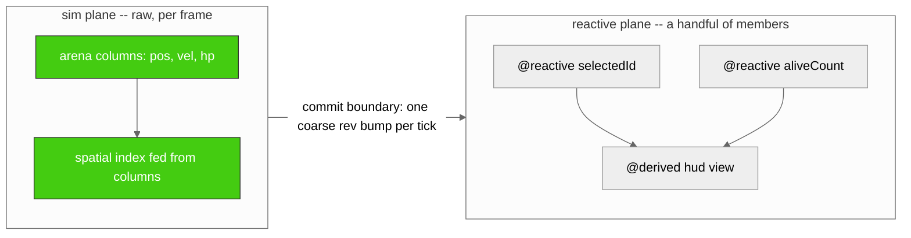

# The lite-signal-decorators cookbook

> The README tells you what each export does. This tells you how to build the thing you actually came here to build -- and what it costs before you ship it.

The README is a reference. It answers *what does `@reactive` do, what does `costOf` return, what throws and when*. It is exhaustive and it is flat: sixteen exports, one law each.

This is the cookbook. It answers *how do I model a collection without leaking a node per element, how do I prove my teardown to CI, how do I watch a view-model from the outside without the watcher silently going deaf.* It is a small number of problems, each worked end to end, each with the price tag attached.

Recipes are graded in four tiers:

- **Start here (0)** -- you have decorated one class and want to see the number it costs before you decide anything gates.
- **Basics (1-3)** -- your first proven teardown, watching a member from outside, and sizing a whole app's registry at boot so the instance you did not budget for fails loudly instead of leaking quietly.
- **Working (4-8)** -- reactive collections that do not pay a node per element, deep-subtree boundaries stamped by one `rev`, the lite-store seam, walking a VM for serialization, and the async boundary.
- **Pro (9-11)** -- the two-plane fleet (a sim plane written raw against arena columns, a reactive plane committed once per tick), registry isolation and what refuses to cross a registry line, and one full MobX store migrated onto the composition stack.

Read them in order if you are new; jump by the Contents if you know the shape of your problem.

Every recipe has the same five parts:

- **Goal** -- the one thing you are trying to make true.
- **The forces** -- what makes it hard, and why the obvious approach costs more than it looks.
- **Code** -- the smallest correct version.
- **What it costs** -- the capacity math, always, in `costOf` / `capacityFor` terms: `nodes = P + D + E + 1`, links measured at first read. A recipe that allocates says so here, in its own words, with the reason.
- **Gotchas** -- the traps, stated as the outcomes you want to see fire, not the errors to route around.

The runnable code is not decorative. Every fenced block tagged `<!-- COOKBOOK:rNN.k -->` is the exact bytes of a companion in `cookbook/`, extracted and byte-compared by `test/15-cookbook.test.mjs` in both directions: change the prose freely, but change the code in the markdown and the build fails until the companion agrees. The companions run under `npm run cookbook` -- each standalone, under `node --expose-gc`. Six of the twelve are GC-gated: they hold the S1 budget (`gc.major === 0`, `maxPauseMs <= 4.0`, minors control-relative) and each carries a `COOKBOOK_BREAK=<id>` sabotage control, on the principle that a gate that cannot fail is not a gate. The other six publish, in the manifest and in their own prose, why they are cold rather than gated.

**One note before you start, true for every runnable block below.** The executable code uses `defineReactive(Class, spec)` -- the buildless twin. It is the identical wiring: same core, reached by function identity, running under plain Node with no transpiler. The decorator tier (`@reactive accessor` / `@derived get` / `@reactiveEffect` / `@batched` / `@reactiveHost`) is line-for-line equivalent -- it installs the same nodes at the same cost -- and appears only in clearly-marked, non-executable illustration blocks. When you see a `defineReactive` call in a runnable block, the decorated class beside it in your own transpiled codebase costs exactly the same.

---

## Contents

**Diagrams**

- [D1 -- The two planes](#d1----the-two-planes)
- [D2 -- MobX parity by composition](#d2----mobx-parity-by-composition)
- [D3 -- The cost ladder](#d3----the-cost-ladder)

**Recipes**

0. [Just show me what one instance costs](#recipe-0----just-show-me-what-one-instance-costs)
1. [Prove your teardown](#recipe-1----prove-your-teardown)
2. [Watching a VM member from outside](#recipe-2----watching-a-vm-member-from-outside)
3. [Budgeting a whole app](#recipe-3----budgeting-a-whole-app)
4. [A reactive collection without a node per element](#recipe-4----a-reactive-collection-without-a-node-per-element)
4b. [The same collection, sorted and filtered](#recipe-4b----the-same-collection-sorted-and-filtered)
5. [The rev-stamped deep-subtree boundary](#recipe-5----the-rev-stamped-deep-subtree-boundary)
6. [The lite-store boundary: document state meets class state](#recipe-6----the-lite-store-boundary-document-state-meets-class-state)
7. [Walking and serializing a VM](#recipe-7----walking-and-serializing-a-vm)
8. [The async boundary](#recipe-8----the-async-boundary)
9. [Pro: the two-plane fleet](#recipe-9----pro-the-two-plane-fleet)
10. [Pro: registry isolation, and what refuses to cross](#recipe-10----pro-registry-isolation-and-what-refuses-to-cross)
11. [Pro: a MobX store, migrated](#recipe-11----pro-a-mobx-store-migrated)
12. [Wait for a condition, as a Promise](#recipe-12----wait-for-a-condition-as-a-promise)
13. [React to a computed value, not every write](#recipe-13----react-to-a-computed-value-not-every-write)
14. [Tie teardown to an AbortSignal](#recipe-14----tie-teardown-to-an-abortsignal)
15. [Async state without async in the graph](#recipe-15----async-state-without-async-in-the-graph)
16. [Read without subscribing](#recipe-16----read-without-subscribing)
17. [Pro: start the resource when someone is watching](#recipe-17----pro-start-the-resource-when-someone-is-watching)

**Appendix**

- [Running the companions](#appendix----running-the-companions)

---

## Diagrams

### D1 -- The two planes

Most of what this package is for lives on one side of a line. On the other side is the raw simulation. The line between them is the only place they touch.



The sim plane writes raw. Thousands of entities, columns of `Float64Array`, no signal in sight -- because a signal per entity per field is thousands of nodes churning every frame, and that is the wall this whole design exists to stay behind. The reactive plane holds only the members a human reads: a selection, a count, a derived HUD. Between them sits one commit: at the tick boundary the sim bumps a single `rev` (or writes a small fixed set of members), and the reactive plane recomputes once. The generalization of that boundary is the recurring lesson of this cookbook -- **you do not make the collection reactive; you make one stamp reactive and let it point at plain data.** Recipe 9 builds the full two-plane fleet; Recipes 4 and 5 build the boundary in miniature.

### D2 -- MobX parity by composition

This is the headline. The README's migration tables cover the one-to-one decorator vocabulary; this extends the mapping to the *rest* of MobX -- the parts that are not a decorator swap, the parts you reach a suite member for, and the two places where the honest answer is "we do not offer that, here is the path instead." Read the **Honest note** column as the load-bearing one.

| MobX construct | This package | Or this suite member | Recipe | Honest note |
|---|---|---|---|---|
| `observable` (primitive) | `@reactive accessor` | -- | r0 | 1 node, fixed at decoration time |
| `computed` | `@derived get` | -- | r0 | lazy; links form at first read, not at decoration |
| `action` | `@batched` | `registry.batch(...)` | r5 | allocates a thunk + rest-array per call, by design -- action-grade, not per-frame |
| `autorun` / `reaction` | `@reactiveEffect` | `@zakkster/lite-watch-ex` | r2, r13 | watchers bind the default registry ONLY; a custom-registry instance never fires one (PD-29); a reaction reads a `@derived` selector so it fires on the computed value, not every write (r13) |
| `makeObservable(this, {...})` | `@reactiveHost` / `defineReactive` | -- | r0 | one wiring site in the most-derived constructor; no mirror object to keep in sync |
| `observable.array` | `rev` + `length` signal | `@zakkster/lite-signal-dom` `keyed()` | r4 | NEVER a node per element; the list stays a plain array |
| `observable.map` | `rev` + `size` signal over a plain `Map` | `@zakkster/lite-store` | r4 | lite-store is opaque on `Map` (card: NOT FOR); stamp a plain `Map` instead |
| `observable.deep` | rev-stamped boundary | `@zakkster/lite-store` `store()` | r5, r6 | the lite-store path is **NOT zero-GC** -- lazy per-key signals + a deep-copying `snapshot()` |
| `observable.ref` / `.shallow` | `@reactive` (default `Object.is`) | -- | r0 | already the default; a `@reactive` member compares by identity unless you pass `equals` |
| `toJS` | `snapshotOf(vm)` (native since 1.3.0) | `@zakkster/lite-store` `snapshot()` | r7 | both allocate; both are cold, opt-in, off any frame path |
| `when` (promise form) | -- | `@zakkster/lite-await` `whenSignal` | r8, r12 | a Promise per call -- a lifecycle boundary only, never inside a loop; r12 shows the manual deferred + the timeout/AbortSignal variants |
| `onBecomeObserved` / `onBecomeUnobserved` | -- | `@zakkster/lite-signal` `observeObservers` | r17 | transition-only (0->1 / 1->0); a REAL tracked read drives it, construction alone does not; top-level is default-registry-only (PD-29) |
| `observe` / `intercept` | -- | -- | r7 | not offered; `rootOf(vm)` + `registry.forEachOwned` is the audit path, and it is opt-in |
| `runInAction` | `@batched` | `registry.batch` | r5 | same note as `action` -- one call per user intent |
| disposal | `disposeReactive(vm)` | -- | r1 | **MobX has no equivalent.** Its per-instance graph ends when the collector decides; here it is one idempotent, node-exact call |

Two rows carry the whole argument. `observable.deep` is where MobX's ergonomics are best and its cost is least visible; the honest answer is that the deep path allocates, so you either stamp a `rev` at the boundary (zero-GC, r5) or hand it to lite-store and accept the allocation knowingly (r6). And `disposal` is the row MobX cannot fill: "the collector will get it eventually" is not a lifecycle, and Recipe 1 exists to prove that this one is.

### D3 -- The cost ladder

Every capacity decision in this cookbook is one ladder, climbed once at boot:

```
costOf(Factory)            -> { nodes, links, signals, deriveds, effects }
   nodes = P + D + E + 1                 exact, shape-determined
   links = first-full-read count         measured, not guessed
      |
capacityFor(inventory, { headroom })  -> { maxNodes, maxLinks, prealloc: "eager", onCapacityExceeded: "throw" }
   maxNodes = sum(cost.nodes x count)    exact
   maxLinks = sum(cost.links x count) x headroom
      |
createRegistry(config)     -> a bound registry, preallocated eager
      |
the k+1-th instance        -> throws CapacityError, at the front door, by name
```

`nodes` is exact because the shape is fixed at decoration: `P` reactive signals, `D` deriveds, `E` effects, plus one anchor. `links`, though, is the *first-full-read* count -- the dependency edges a derived forms the first time it runs to completion. That is the one place the ladder can under-provision, and it does so loudly. A **fixed-shape** derived reads the same members every run and `capacityFor` sizes it exactly. A **branchy** derived -- one whose active branch reads more members than the probe happened to see -- forms more links than were budgeted, and the engine throws `CapacityError` at link formation rather than silently overflowing (decisions/0007). The knob is `headroom`. Recipe 3's companion measures a branchy derived at `links === 2` on the probe (the `hp > 0` branch) whose widest live branch reads 4 members; `headroom: 3` provisions the widest branch and it fits. When you have branchy deriveds, size for the branch you fear, not the branch you measured.

---

## Recipe 0 -- Just show me what one instance costs

**Goal.** Decorate one class, then read -- exactly, not approximately -- what a single instance of it costs the reactive graph, before you decide whether anything needs a budget.

**The forces.** Sizing is the thing every other recipe depends on, and it is the thing most reactive libraries cannot give you a straight answer to, because the cost is hidden behind proxies and lazy graphs. Here the cost is shape-determined -- `nodes = P + D + E + 1` -- so it *can* be a number. The only hard part is honesty: a derived's link count depends on what it reads, and a derived that reads a different set of members on different runs has no single answer. `costOf` refuses to average that into a lie.

**Code.**

<!-- COOKBOOK:r0.1 -->
```js
import { defineReactive, costOf } from "@zakkster/lite-signal-decorators";

// A small view-model: 2 reactive signals (P), 1 lazy derived (D), 0 effects (E).
// defineReactive is the buildless twin of the @reactiveHost decorator stack --
// same wiring core, so a decorated `class Vitals` costs exactly what this costs.
class VitalsBase {}
const Vitals = defineReactive(VitalsBase, {
    signals: { hp: 100, mp: 50 },
    deriveds: { alive: (self) => self.hp > 0 },
    effects: {},
});

const cost = costOf(Vitals);
// nodes = P + D + E + 1 (the anchor). Here: 2 + 1 + 0 + 1 = 4.
// links = the first-full-read dependency count: `alive` reads `hp` once -> 1.
const expectedNodes = cost.signals + cost.deriveds + cost.effects + 1;
```

The decorator form is line-for-line equivalent -- the same three members, the same four nodes -- it just needs a build step:

<!-- COOKBOOK:pointer @zakkster/lite-signal-decorators -->
```js
import { reactive, derived, reactiveHost } from "@zakkster/lite-signal-decorators";

@reactiveHost
class Vitals {
    @reactive accessor hp = 100;
    @reactive accessor mp = 50;
    @derived get alive() { return this.hp > 0; }
}
// costOf(Vitals) is the SAME { nodes: 4, links: 1 } as the defineReactive twin above.
```

*Non-runnable: the decorator tier (this package's own Start-here surface) needs a standard-decorators transpiler (TypeScript 5 / Babel 2023-11), which this corpus does not run. The `defineReactive` block above is its executable equivalent.*

The result is a fact, not a snapshot -- frozen and cached by class identity, so sizing a class you never construct costs you one probe and nothing after:

<!-- COOKBOOK:r0.2 -->
```js
// costOf is frozen and cached per class: the second call returns the SAME
// object, and a class you never size costs you nothing.
const again = costOf(Vitals);
const cached = again === cost;                 // true -- identity, not a re-probe
const frozen = Object.isFrozen(cost);          // true -- you cannot mutate a fact
```

And when the number would be a lie, `costOf` throws instead of returning it:

<!-- COOKBOOK:r0.3 -->
```js
// costOf never guesses. It probes TWICE and requires identical deltas; a
// data-dependent derived (one whose dependency set changes between reads) makes
// the two probes disagree, and costOf THROWS instead of returning a number that
// would be wrong for half your instances.
let probe = 0;
class FlakyBase {}
const Flaky = defineReactive(FlakyBase, {
    signals: { a: 1, b: 2 },
    // reads a DIFFERENT number of members on successive probes -> links disagree.
    deriveds: { d: (self) => ((probe++ & 1) ? self.a : self.a + self.b) },
    effects: {},
});

let threwName = null;
try {
    costOf(Flaky);                             // never returns here
} catch (err) {
    threwName = err.name;                      // the honest outcome: a throw
}
```

**What it costs.** `Vitals` is `nodes = P + D + E + 1 = 2 + 1 + 0 + 1 = 4`, and `links = 1` (the single edge `alive -> hp`, formed the first time `alive` runs). That is the entire per-instance footprint: four nodes, one link, regardless of what `hp` and `mp` hold. `costOf` itself is the only allocation in this recipe, and it happens once per class, then never again -- the second call is an identity return off the cache. This recipe is **not gated**: `costOf` is a cold double-probe done at decoration time, a sizing tool, never a frame path -- which is exactly why it can afford to probe twice and throw rather than guess.

**Gotchas.**

- The throw on `Flaky` is the feature. A derived whose dependency set changes between reads has no single link count, and a library that returned one anyway would under-provision half your instances silently. `costOf` makes that a loud, named error at sizing time. If you hit it, your derived is branchy -- either make it fixed-shape, or size it with `headroom` (Recipe 3).
- `nodes` is exact and cheap to reason about; `links` is measured and is the number `capacityFor` scales by `headroom`. Do not eyeball links -- read them off `costOf`.
- `costOf` constructs its probe with no constructor arguments. If your class needs constructor args to reach a representative shape, the probe sees the argument-free shape; size from a factory that reflects steady state.

---

## Recipe 1 -- Prove your teardown

**Goal.** Show, mechanically, that disposing a fleet of view-models returns the graph to exactly where it started -- no node outlives its owner, and the one instance you forgot to dispose is caught, not lost.

**The forces.** This is the row MobX cannot fill. Reaction disposers clean up subscriptions; the instance graph itself ends when the collector decides, which means "did my teardown actually work" is a question you cannot answer -- you can only wait and hope. Here disposal is one call, and it is provable three ways at once: a retention tracker that must return to zero, a registry ledger that must balance to the exact pre-cycle baseline, and an opt-in auditor that fires on the instance you never disposed. The subtlety is the auditor's reach -- it catches instances that reach GC, which is *not* the same set as instances that leaked.

**Code.** First, the fleet and its baseline. A real fleet lives on its own bound registry sized by `capacityFor`, because the default registry ceils at 1024 nodes:

<!-- COOKBOOK:r1.1 -->
```js
import { effect, createRegistry, stats } from "@zakkster/lite-signal";
import {
    createLeakTracker,
    createOwnerCascadeOrphanKernel,
} from "@zakkster/lite-leak";
import {
    defineReactive,
    disposeReactive,
    capacityFor,
    auditReactive,
} from "@zakkster/lite-signal-decorators";

// The fleet: 512 live view-models, each P=2 signals, D=1 derived, E=0.
// capacityFor sizes a registry EXACTLY for that inventory (headroom leaves room
// for the deriveds' links); the default registry ceils at 1024 nodes, so a real
// fleet lives on its own bound registry.
const Probe = defineReactive(class {}, {
    signals: { hp: 100, mp: 50 },
    deriveds: { alive: (self) => self.hp > 0 },
    effects: {},
});
const registry = createRegistry(capacityFor([[Probe, 512]], { headroom: 2 }));
const Mob = defineReactive(class {}, {
    signals: { hp: 100, mp: 50 },
    deriveds: { alive: (self) => self.hp > 0 },
    effects: {},
    host: { registry },
});

const baseline = registry.stats().activeNodes;   // the floor teardown must return to
```

Now the churn. Each instance is tracked from inside a short-lived effect so reclamation is deterministic, not GC-dependent -- and the held-value contract is honored: neither the cleanup nor the tag closes over the instance:

<!-- COOKBOOK:r1.2 -->
```js
// A lite-leak tracker with the owner-cascade kernel watches the reactive tree
// this package owns. HELD-VALUE CONTRACT: neither `release` (the cleanup) nor
// the numeric `tag` closes over the instance -- capturing it would defeat
// finalization and report a false clean.
const leaks = [];
const warns = [];
const tracker = createLeakTracker({
    name: "teardown",
    onLeak: (r) => leaks.push(r.kind + ":" + String(r.tag)),
    onWarning: (w) => warns.push(w.kind + ":" + w.reason),
});
tracker.registerKernel(createOwnerCascadeOrphanKernel());
function release() {}                            // captures nothing

// Track each instance from INSIDE a short-lived effect: the effect becomes the
// owner and registers onCleanup(untrack). Disposing the instance and stopping
// that effect makes reclamation DETERMINISTIC -- not GC-dependent.
const N = 512;
const CYCLES = 4096;
const live = new Array(N).fill(null);
const stops = new Array(N).fill(null);
for (let i = 0; i < CYCLES; i++) {
    const slot = i % N;
    if (live[slot] !== null) {
        disposeReactive(live[slot]);             // cascade + poison the old one
        stops[slot]();                           // effect cleanup -> untrack
    }
    const vm = new Mob();
    vm.hp = i & 1023;
    const tag = i & 255;                         // detached primitive; no capture
    const stop = effect(() => { tracker.track(vm, release, tag, { audit: true }); });
    live[slot] = vm;
    stops[slot] = stop;
}
for (let s = 0; s < N; s++) {
    if (live[s] !== null) { disposeReactive(live[s]); stops[s](); live[s] = null; stops[s] = null; }
}
```

The three proofs, read after a settle tick:

<!-- COOKBOOK:r1.3 -->
```js
// The three proofs, read after a settle tick.
const retained = tracker.size();                 // 0 -- nothing outlived its owner
const findings = tracker.audit();                // [] -- no orphaned reactive nodes
const s = registry.stats();
const conserved =
    s.activeNodes === baseline &&                // back to the exact floor
    s.totalAllocations - s.totalDisposals === s.activeNodes;   // ledger balances
```

And the safety net for the one you forgot -- with its reach caveat honored in the code, not just the comment:

<!-- COOKBOOK:r1.4 -->
```js
// The one you FORGOT. auditReactive(true) lazily arms a FinalizationRegistry
// that reports any instance GC'd WITHOUT disposeReactive. REACH CAVEAT
// (llms.txt:168-171): an instance still pinned by its own undisposed nodes on a
// long-lived registry is never collected, so audit cannot fire for it -- that
// retention is what the lite-leak pass above catches. Audit fires for instances
// that reach GC whole, e.g. a per-scope registry dropped entirely.
let auditFires = 0;
const realError = console.error;
console.error = () => { auditFires++; };         // capture the audit report
auditReactive(true);
(function dropWholeScope() {
    const scoped = createRegistry(capacityFor([[Probe, 4]]));
    const Scoped = defineReactive(class {}, {
        signals: { hp: 100, mp: 50 },
        deriveds: { alive: (self) => self.hp > 0 },
        effects: {},
        host: { registry: scoped },
    });
    let forgotten = new Scoped();                 // never disposed
    forgotten.hp = 1;
    void forgotten.alive;
    forgotten = null;                             // drop instance AND scope together
})();
```

**What it costs.** Each `Mob` is `P + D + E + 1 = 2 + 1 + 0 + 1 = 4` nodes; the fleet of 512 is sized by `capacityFor([[Probe, 512]], { headroom: 2 })`, which is `4 * 512` nodes exact and `links * 512 * 2` for headroom on the deriveds. Over 4096 construct/dispose cycles the node pool is reused, so the loop provokes no major collection and stays under the pause budget -- the recipe is **GC-gated** on that. The one honest allocation is the JS instance shell of each `new Mob()`; teardown returns the reactive *nodes*, not the object, and the retention proof (`tracker.size()` back to 0, ledger balanced to `baseline`) is what gates the leak. `COOKBOOK_BREAK=r1` allocates one throwaway array per op inside the measured loop; the minors gate then fails, which is how you know the gate is real.

**Gotchas.**

- The reach caveat is the honest limit and it is stated in the code, not hidden. `auditReactive` catches instances that reach GC *whole* -- the classic case is a per-scope registry dropped entirely, as `dropWholeScope` does. It **cannot** catch an instance still pinned by its own undisposed nodes on a long-lived registry, because that instance never reaches GC at all. That retention is a different failure, and it is what the lite-leak pass above exists to catch. Two tools, two failure modes; neither one alone is the proof.
- The held-value contract bites silently if you break it. If `release` or `tag` closes over the instance, finalization never runs and the harness reports a clean that is not real. Keep the cleanup a bare function and the tag a primitive.
- Track from inside an effect. That makes the effect the owner and the reclamation deterministic; tracking from plain code leaves reclamation to the collector, which is exactly the uncertainty you are trying to eliminate.

---

## Recipe 2 -- Watching a VM member from outside

**Goal.** Observe a view-model member from code that does not own it -- a watcher, an external reaction -- and understand the one rule that decides whether that watcher ever fires.

**The forces.** `@zakkster/lite-watch-ex` watches a plain thunk: `() => vm.hp`. That reads the accessor, which subscribes on whatever registry the instance's box lives in. But lite-watch-ex binds its `effect` on the **default** registry at import time -- like any library that captures lite-signal's top-level helpers at module load (the PD-29 pattern). So the watcher's effect and the instance's box can end up in different registries, and when they do the watcher simply never fires. No error. No warning. It goes deaf, silently. The only defense is to know the rule and assert it.

**Code.** A default-registry VM watched by a plain thunk -- never a box handle, which is not callable:

<!-- COOKBOOK:r2.1 -->
```js
import { createRegistry } from "@zakkster/lite-signal";
import { watch } from "@zakkster/lite-watch-ex";
import { defineReactive, boxOf } from "@zakkster/lite-signal-decorators";

// A default-registry view-model. lite-watch-ex binds `effect` on the default
// registry at import, so this is the ONLY registry its watchers can observe.
const Player = defineReactive(class {}, {
    signals: { hp: 100, mp: 50 },
    deriveds: { alive: (self) => self.hp > 0 },
    effects: {},
});
const player = new Player();

// Watch a THUNK -- `() => player.hp` -- never boxOf(player, "hp"): that returns
// a non-callable engine handle, not a source a watcher can call.
let hits = 0;
const stop = watch(() => player.hp, (next, prev) => { hits += next - prev; });
```

Now the wall, made executable. A twin on its own registry advances its own value fine -- but a watcher pointed at it never fires:

<!-- COOKBOOK:r2.2 -->
```js
// The PD-29 wall, made executable. A twin on its OWN registry advances, but a
// watcher pointed at it NEVER fires -- the watcher's effect is on the default
// registry, the instance's box is not. This is silent by nature; assert it.
const isolated = createRegistry({
    maxNodes: 64, maxLinks: 64, prealloc: "eager", onCapacityExceeded: "throw",
});
const Npc = defineReactive(class {}, {
    signals: { hp: 100 },
    deriveds: {},
    effects: {},
    host: { registry: isolated },
});
const npc = new Npc();

let defaultFires = 0;
let customFires = 0;
const stopDefault = watch(() => player.hp, () => { defaultFires++; });
const stopCustom = watch(() => npc.hp, () => { customFires++; });   // will NEVER fire
for (let k = 1; k <= 5; k++) { player.hp = 100 - k; npc.hp = 100 - k; }
// defaultFires === 5 ; customFires === 0 -- the wall.
```

**What it costs.** Watching adds nothing to the VM: the instance is still its bare `P + D + E + 1` nodes. The watcher is one effect node on the default registry -- one node per watcher, not per change. In steady state a source change is pure propagation with zero allocation per change, at or below the stamped zero-GC noise floor, so this recipe is **GC-gated** on the source-change path. `COOKBOOK_BREAK=r2` allocates one throwaway array per op in the measured loop and the gate fails.

**Gotchas.**

- **Never point a watcher at a custom-registry instance.** `defaultFires === 5`, `customFires === 0` -- that is the wall, and it is silent. If you must watch a bound-registry VM from outside, run your watcher's effect inside that same registry, or expose a default-registry mirror member. This is not a lite-watch-ex bug; it is the general rule that any library capturing lite-signal's top-level helpers at import is default-registry-only, and you cannot tell from its README. Grep it for `registry`. Recipe 10 generalizes this.
- Watch a thunk, not a box. `boxOf(vm, key)` returns a non-callable engine handle -- useful for introspection, useless as a watch source. `() => vm.hp` is the source; the box is not.
- The companion asserts `customFires === 0` on purpose. A silent non-firing is the kind of bug that survives code review; the only way to keep it caught is to test that it stays silent exactly where the wall predicts.

---

## Recipe 3 -- Budgeting a whole app

**Goal.** Size one registry for your whole app's view-model inventory at boot, so the graph is preallocated eager and the instance you did not budget for throws at the front door instead of leaking in production.

**The forces.** A registry that grows on demand hides the moment you crossed a line you did not know you had. `capacityFor` inverts that: you declare the inventory once, it sums the exact node cost and scales the links by `headroom`, and the config it returns fails closed -- `prealloc: "eager"`, `onCapacityExceeded: "throw"`. The one place this can bite is the branchy derived: `capacityFor` sizes links from what the probe measured, and a derived whose live branch reads more than the probe saw will overflow at link formation. That is a feature -- it is loud and named -- but you have to size for the branch you fear.

**Code.** Three VM classes, one config sized for the fleet, the node math readable straight off `costOf`:

<!-- COOKBOOK:r3.1 -->
```js
import { createRegistry } from "@zakkster/lite-signal";
import { defineReactive, costOf, capacityFor } from "@zakkster/lite-signal-decorators";

// Three view-model classes in one app.
const Enemy = defineReactive(class {}, {
    signals: { hp: 100, x: 0, y: 0 },                       // P=3
    deriveds: { alive: (self) => self.hp > 0 },             // D=1
    effects: {},                                            // E=0  -> nodes 5
});
const Pickup = defineReactive(class {}, {
    signals: { kind: 0, x: 0, y: 0 },                       // P=3, D=0, E=0 -> nodes 4
    deriveds: {},
    effects: {},
});
const Hud = defineReactive(class {}, {
    signals: { score: 0, combo: 0 },                        // P=2
    deriveds: { rank: (self) => (self.score / 1000) | 0 },  // D=1  -> nodes 4
    effects: {},
});

// One config sized for the whole fleet. Nodes are the exact sum of cost.nodes x
// count; you can read the math straight off costOf.
const config = capacityFor([
    [Enemy, 200],
    [Pickup, 64],
    [Hud, 1],
]);
const budgetedNodes =
    costOf(Enemy).nodes * 200 + costOf(Pickup).nodes * 64 + costOf(Hud).nodes * 1;
```

The branchy-derived case, sized for the widest branch:

<!-- COOKBOOK:r3.2 -->
```js
// A BRANCHY derived: the no-arg probe sees hp=100 and reads {hp, a} = 2 links,
// but when hp drops to 0 the live branch reads {hp, a, b, c} = 4. Sizing at the
// default headroom 1 provisions the measured 2, so the 4-link branch throws
// CapacityError at link formation. headroom 3 leaves room for the widest branch.
const Threat = defineReactive(class {}, {
    signals: { hp: 100, a: 1, b: 2, c: 3 },
    deriveds: { level: (self) => (self.hp > 0 ? self.a : self.a + self.b + self.c) },
    effects: {},
});
const roomy = createRegistry(capacityFor([[Threat, 4]], { headroom: 3 }));
const Sized = defineReactive(class {}, {
    signals: { hp: 100, a: 1, b: 2, c: 3 },
    deriveds: { level: (self) => (self.hp > 0 ? self.a : self.a + self.b + self.c) },
    effects: {},
    host: { registry: roomy },
});
let widestBranchFits = true;
try {
    for (let i = 0; i < 4; i++) { const t = new Sized(); t.hp = 0; void t.level; }   // widest branch
} catch (_e) {
    widestBranchFits = false;
}
```

And the throw you should provoke on purpose, once, to know the wall is where you think it is:

<!-- COOKBOOK:r3.3 -->
```js
// Provoke the CapacityError on purpose. A registry sized for exactly 3 enemies
// builds 3; the 4th is not in your budget, so `new` throws -- fail closed, at the
// boundary, with a name you can catch.
const tight = createRegistry(capacityFor([[Enemy, 3]]));
const Grunt = defineReactive(class {}, {
    signals: { hp: 100, x: 0, y: 0 },
    deriveds: { alive: (self) => self.hp > 0 },
    effects: {},
    host: { registry: tight },
});
let builtBeforeThrow = 0;
let capacityError = null;
try {
    for (let i = 0; i < 4; i++) { new Grunt(); builtBeforeThrow++; }
} catch (err) {
    capacityError = err.name;                                // "CapacityError" at the 4th
}
```

**What it costs.** `maxNodes` is exact: `Enemy(5) * 200 + Pickup(4) * 64 + Hud(4) * 1` -- summed straight off `costOf(Factory).nodes`, no estimate. `maxLinks` is the summed link count scaled by `headroom` (default 1 = exact). The branchy `Threat` probes at `links === 2` but its widest live branch reads 4, so `headroom: 3` provisions `2 * 4 * 3` links and the 4-link branch fits. This recipe is **not gated**: `capacityFor` is cold sizing done once at boot, and the `CapacityError` it provokes is a boot-time outcome, not a frame path -- which is why the recipe can afford to trip it on purpose.

**Gotchas.**

- Provoke the `CapacityError` once, deliberately, in a test. `builtBeforeThrow === 3` then the 4th throws by name -- that is fail-closed sizing working. A registry that silently grew past your budget would turn a capacity bug into a slow production leak; this one turns it into a named throw at construction.
- Branchy deriveds are the one thing `capacityFor` cannot size from the probe alone. The probe reads the branch that `hp === 100` selects; if a different branch reads more members, size for it with `headroom`. `costOf(Threat).links === 2` tells you the probe's number, not the worst case -- you supply the worst case.
- `headroom` scales links, never nodes. Nodes are exact and do not need slack; links are where first-full-read uncertainty lives.

---

## Recipe 4 -- A reactive collection without a node per element

**Goal.** Model a growing collection reactively where the per-instance cost is the owner's `P + D + E + 1` and *nothing else* -- no node per element, no teardown that walks a hundred thousand boxes.

**The forces.** The obvious approach -- one signal per element -- makes a 100k-item list cost 100k nodes, a 100k-node teardown, and a registry you cannot size at boot. The pattern instead: keep the data a **plain array** (or an arena column), and make exactly two things reactive -- a `rev` stamp and a `length` -- both bumped by the mutators. Readers subscribe to `rev`; the data itself carries no nodes. The whole collection then costs what its owner costs, flat, at any size.

**Code.** The owner: two reactive members total, whatever the element count.

<!-- COOKBOOK:r4.1 -->
```js
import { stats } from "@zakkster/lite-signal";
import { defineReactive, costOf, disposeReactive } from "@zakkster/lite-signal-decorators";

// The collection owner: two reactive members total, whatever the element count.
// `items` is a plain array -- NOT reactive, NOT a node per element.
class ListBase {
    constructor() { this.items = []; }
    push(v) { this.items.push(v); this.length = this.items.length; this.rev = this.rev + 1; }
    setAt(i, v) { this.items[i] = v; this.rev = this.rev + 1; }   // O(1) in-place commit
    clear() { this.items.length = 0; this.length = 0; this.rev = this.rev + 1; }
}
const List = defineReactive(ListBase, {
    signals: { rev: 0, length: 0 },   // P=2
    deriveds: {},                     // D=0
    effects: {},                      // E=0  -> nodes = 2 + 0 + 0 + 1 = 3
});
```

The proof that the cost does not move with the element count:

<!-- COOKBOOK:r4.2 -->
```js
// CB-A5: the per-instance cost is invariant to element count. costOf(List).nodes
// is IDENTICAL at 0, 1, 1000, and 100_000 items, and equals P+D+E+1.
const nodesBySize = {};
let activeAtZero = 0;
let activeAtHundredK = 0;
for (const size of [0, 1, 1000, 100000]) {
    const before = stats().activeNodes;
    const list = new List();
    for (let i = 0; i < size; i++) list.push(i);   // plain-array growth, no new nodes
    nodesBySize[size] = costOf(List).nodes;
    const built = stats().activeNodes - before;     // reactive nodes this list added
    if (size === 0) activeAtZero = built;
    if (size === 100000) activeAtHundredK = built;
    disposeReactive(list);
}
```

When you need the list rendered into the DOM with per-row identity, that is where a keyed reconciler earns its place -- but it is a DOM concern, not this package's:

<!-- COOKBOOK:pointer @zakkster/lite-signal-dom -->
```js
import { keyed } from "@zakkster/lite-signal-dom";

// keyed(parent, listGetter, keyFn, renderFn) -- an ECS-style keyed list
// reconciler: node-pooled, zero-GC in steady state. keyFn gives each row a
// stable identity so a reorder MOVES a pooled DOM node instead of rebuilding it.
const dispose = keyed(
    parent,
    () => list.items,          // listGetter: read the plain array (subscribe via rev upstream)
    (item) => item.id,         // keyFn: stable per-row identity
    (item, el) => { el.textContent = item.label; },  // renderFn
);
```

*Non-runnable: `@zakkster/lite-signal-dom` (Working tier) needs a DOM lane this corpus does not have. Its peer floor is satisfied -- `keyed()` needs `getOwner`/`runWithOwner`, both present in lite-signal 1.5.0 stable -- so this is a lane gap, not a peer problem. The `rev` + `length` owner above still drives it: `keyed()` reads the plain array, and your `rev` bump is what tells it to reconcile.*

**What it costs.** `List` is `P + D + E + 1 = 2 + 0 + 0 + 1 = 3` nodes, and that number is *invariant*: the companion asserts `costOf(List).nodes` is identical at 0, 1, 1000, and 100000 items, and that the registry's `activeNodes` after building the 100k-item list equals the value after the empty one. A 100k-item collection costs three nodes. Growth is plain-array growth -- amortized array cost, zero reactive nodes. An in-place `setAt` + `rev` bump is a zero-allocation commit, so this recipe is **GC-gated** on the commit-plus-read path; `COOKBOOK_BREAK=r4` allocates per op and fails it.

**Gotchas.**

- **Never a node per element.** `activeAtHundredK === activeAtZero` is the law, asserted. If your collection's node count grows with its length, you have signals where you should have plain data -- back the elements out into an array and stamp a `rev`.
- Subscribe to the stamp, mutate in place. `setAt(i, v)` writes the array slot and bumps `rev` -- O(1). Readers that touched `rev` recompute; the array itself is never tracked.
- For DOM rendering with per-row identity, reach for `keyed()` -- but that is a DOM boundary, not a reason to make the list reactive per element. The list stays plain; the reconciler keys off it.

---

## Recipe 4b -- The same collection, sorted and filtered

**Goal.** Derive a sorted, filtered view of the collection that recomputes **once per commit** -- not once per element added.

**The forces.** A view over a collection is where per-element reactivity sneaks back in: subscribe to each element and the sort recomputes on every insert. The fix is the same stamp. A `@derived` reads the `rev` stamp and scans the plain array; it recomputes when `rev` changes -- one recompute per commit -- and never per element. The derived is one node; the scan is O(n) work done once per commit, which is the price of a sort you actually asked for, not a hidden per-insert cost.

**Code.** A sorted top-5 view over the rev stamp:

<!-- COOKBOOK:r4.4 -->
```js
// 4b -- a sorted + filtered VIEW, computed once per commit. The @derived reads
// the rev stamp, then scans the plain array. It recomputes when rev changes --
// ONE recompute per commit -- not once per element pushed.
let recomputes = 0;
class LeaderboardBase {
    constructor() { this.scores = []; }
    add(score) { this.scores.push(score); this.rev = this.rev + 1; }   // one commit
}
const Leaderboard = defineReactive(LeaderboardBase, {
    signals: { rev: 0 },
    deriveds: {
        top5: (self) => {
            recomputes++;
            void self.rev;                          // subscribe to the stamp
            return self.scores.slice().sort((a, b) => b - a).slice(0, 5);
        },
    },
    effects: {},
});
```

Read the view once per commit and count the recomputes -- it tracks commits, never element count:

<!-- COOKBOOK:r4.5 -->
```js
// Build 10 commits, each adding 100 elements. The view is read after each commit.
const board = new Leaderboard();
for (let commit = 0; commit < 10; commit++) {
    for (let k = 0; k < 100; k++) board.add(commit * 100 + k);
    void board.top5;                                // read the view once per commit
}
const top = board.top5;
// recomputes tracks COMMITS (1000 adds -> at most ~ commits + reads), never 1000.
```

**What it costs.** `Leaderboard` is `P + D + E + 1 = 1 + 1 + 0 + 1 = 3` nodes -- one `rev` signal, one `top5` derived, one anchor -- regardless of how many scores it holds. The companion adds 1000 elements across 10 commits and asserts the view recomputed on the order of commits, not on the order of 1000. Each recompute is an O(n) sort you asked for; the reactive cost of the view is exactly one derived node. If you commit per element instead of batching, you pay one sort per element -- that is a batching choice (Recipe 5), not a reactivity cost.

**Gotchas.**

- The `void self.rev` is load-bearing: it is what subscribes the derived to the stamp. Drop it and the view reads the array once and never updates -- a stale view that looks reactive.
- Recompute count follows commits, so coarsen your commits. One `rev` bump per batch of inserts means one sort per batch. Recipe 5 is how you make a multi-field edit a single commit.
- The sort allocates (a sliced copy) -- honestly, and once per commit. That is the cost of producing a sorted array; it is cold relative to the per-element path it replaces, and it is why 4b is demonstrated alongside the gated commit path rather than gated as a zero-alloc loop itself.

---

## Recipe 5 -- The rev-stamped deep-subtree boundary

**Goal.** Make a deep, nested plain-object subtree reactive through exactly one `rev` stamp at its root, bumped at the mutation site, so a multi-field edit is one commit -- and name the dirty-check polling loop as the anti-pattern it is.

**The forces.** Deep reactivity is where proxies and per-field tracking multiply nodes and hide cost. The flatness law says: nest two or three levels of plain data, put one `@reactive rev` at the subtree root, and bump it at the mutation site. Readers subscribe to `rev` and re-read the plain tree. A multi-field edit wrapped in a batch is one effect flush, not one per field. The temptation to avoid is the opposite extreme -- a dirty-check poll that re-scans the whole tree every frame to discover what changed. That converts an O(1) edge into an O(tree) scan per frame and still misses in-place edits.

**Code.** One reactive `rev`, one effect that reacts to commits, a plain nested tree carrying no nodes:

<!-- COOKBOOK:r5.1 -->
```js
import { createRegistry } from "@zakkster/lite-signal";
import { defineReactive, costOf, disposeReactive } from "@zakkster/lite-signal-decorators";

// One reactive `rev` and one effect that reacts to commits. `tree` is a plain
// nested object -- two or three levels deep -- and carries NO reactive nodes.
let commits = 0;
class DocumentBase {
    constructor() {
        this.tree = { meta: { title: "", tags: [] }, body: { blocks: [], wordCount: 0 } };
    }
    // The mutation SITE: touch plain data, then stamp. Callers batch multi-field
    // edits (see r05.2) so a whole edit is ONE commit.
    setTitle(t) { this.tree.meta.title = t; this.rev = this.rev + 1; }
    setWordCount(n) { this.tree.body.wordCount = n; this.rev = this.rev + 1; }
}
// Bound to its own registry so multi-field edits can batch via registry.batch().
const registry = createRegistry({
    maxNodes: 64, maxLinks: 64, prealloc: "eager", onCapacityExceeded: "throw",
});
const Document = defineReactive(DocumentBase, {
    signals: { rev: 0 },                                    // P=1
    deriveds: {},                                           // D=0
    effects: { onCommit: (self) => { commits++; void self.rev; } },   // E=1 -> nodes 3
    host: { registry },
});
```

Unbatched, three edits are three commits; batched, the same three edits are one:

<!-- COOKBOOK:r5.2 -->
```js
// A multi-field edit. Three plain writes, three rev bumps -- but wrapped in
// registry.batch(...) they coalesce into ONE effect flush. That is the buildless
// spelling of @batched: action-grade (one call per user intent), and it
// allocates a thunk per call by design -- so it is the user-intent path, not the
// per-frame path.
const doc = new Document();
const wireCommits = commits;                               // effect fired once at wire

// Unbatched: three bumps -> three commits.
doc.setTitle("draft");
doc.setWordCount(10);
doc.setTitle("final");
const unbatchedCommits = commits - wireCommits;            // 3

// Batched: the same three edits, ONE commit.
const beforeBatch = commits;
registry.batch(() => {
    doc.tree.meta.title = "shipped";
    doc.rev = doc.rev + 1;
    doc.tree.body.wordCount = 1200;
    doc.rev = doc.rev + 1;
    doc.tree.meta.tags.push("done");
    doc.rev = doc.rev + 1;
});
const batchedCommits = commits - beforeBatch;              // 1
```

The anti-pattern, named and shown so you recognize it in a review:

<!-- COOKBOOK:r5.3 -->
```js
// THE ANTI-PATTERN (do NOT do this): a dirty-check poll that re-scans the tree
// every frame to find what changed --
//
//   function pollFrame(doc, lastSeen) {          // O(tree) EVERY frame
//       const snap = JSON.stringify(doc.tree);   // walks the whole subtree
//       if (snap !== lastSeen) { rerender(); }   // and still misses in-place edits
//       return snap;
//   }
//
// It converts the O(1) rev edge into an O(tree) scan per frame and hides
// staleness instead of failing on it. The rev stamp is the edge: subscribe to
// rev, and a commit tells you exactly once that the tree changed.
```

And the invariance proof -- the boundary cost does not move with the subtree size:

<!-- COOKBOOK:r5.4 -->
```js
// CB-A5: the boundary cost is invariant to subtree size. costOf(Document).nodes
// is IDENTICAL whether the tree holds 0, 1, 1000, or 100_000 plain fields, and
// registry activeNodes after a 100_000-field tree equals the empty-tree value --
// because the fields are plain data, never nodes.
import { stats } from "@zakkster/lite-signal";
const nodesBySize = {};
let activeAtZero = 0;
let activeAtHundredK = 0;
for (const size of [0, 1, 1000, 100000]) {
    const before = stats().activeNodes;
    const d = new Document();
    for (let k = 0; k < size; k++) d.tree.body.blocks.push({ id: k, text: k });   // plain data
    d.rev = d.rev + 1;                                       // one commit, any size
    nodesBySize[size] = costOf(Document).nodes;
    const built = stats().activeNodes - before;
    if (size === 0) activeAtZero = built;
    if (size === 100000) activeAtHundredK = built;
    disposeReactive(d);
}
```

**What it costs.** `Document` is `P + D + E + 1 = 1 + 0 + 1 + 1 = 3` nodes -- one `rev` signal, one `onCommit` effect, one anchor -- and that is invariant whether the tree holds 0 or 100000 plain fields, because the fields are plain data and never nodes. The commit edge (touch a plain field, bump `rev`, let the effect re-run) is pure propagation with zero allocation per commit, so this recipe is **GC-gated** on it; `COOKBOOK_BREAK=r5` breaks it with a per-op allocation. The one deliberate allocation is `registry.batch(...)`, which costs a thunk per call by design -- the buildless spelling of `@batched`, action-grade, one call per user intent, never inside a frame loop.

**Gotchas.**

- The dirty-check poll is the anti-pattern, and its cost is the reason: `JSON.stringify(doc.tree)` every frame is O(tree) per frame, and it *still* misses in-place edits that stringify the same. The `rev` stamp is the O(1) edge -- a commit tells you exactly once that something changed. Poll nothing.
- Batch multi-field edits, do not batch per frame. `registry.batch` coalesces three edits into one commit (`batchedCommits === 1`), which is what you want for a user action; it allocates a thunk, which is why you do not call it once per frame. The per-frame path is a bare accessor write plus a `rev` bump, no batch.
- The `void self.rev` inside `onCommit` is the subscription. Without it the effect runs once at wire and never again -- a boundary that looks live and is not.

## Recipe 6 -- The lite-store boundary: document state meets class state

**Goal.** Bridge two state models that are both correct and both here for a
reason: a lite-store proxy on the document side -- deep, open-ended,
serializable -- and a class-shaped view-model on the other, with a fixed
member set, a cost you can measure, and one deterministic teardown. Wire them
with exactly one effect at the seam and know precisely what that seam costs.

**The forces.** These two models do not merge, and pretending they do is where
people get hurt. A document editor has an unbounded, nested, save-and-load
shape -- that is lite-store's job, and lite-store pays for it with a signal
allocated lazily per key on first tracked read and a `snapshot()` that
deep-copies. A view-model has a decoration-fixed shape with a `P+D+E+1` cost
and a `disposeReactive` -- that is this package's job, and it pays nothing per
frame. Force one to be the other and you either give the document a rigid
schema it does not have, or give the class an open-ended per-key allocation it
was built to avoid. The honest move is to keep both and own the boundary
between them. And the boundary has a direction: lite-store captures
lite-signal's top-level helpers at import (verified: `Store.js:34`, `signal()`
called with no registry argument), so its per-key signals land in the DEFAULT
registry only -- the same PD-29 wall lite-watch-ex sits behind. The bridge is a
default-registry effect, and it can only push VALUES across to a VM you may have
isolated on its own world.

**Code.**

<!-- COOKBOOK:r6.1 -->
```js
import { store, unwrap, snapshot, reconcile, dispose as disposeStore } from "@zakkster/lite-store";
import { effect } from "@zakkster/lite-signal";
import { defineReactive, disposeReactive } from "@zakkster/lite-signal-decorators";

// One side: document-shaped state in a lite-store proxy. Deep, open-ended,
// serializable -- the shape a document editor actually has.
const doc = store({
    title: "Draft",
    wordCount: 0,
    meta: { author: "Ada", tags: ["draft"] },
});

// The other side: a class-shaped view-model. Fixed members, a measured cost,
// one deterministic teardown. (defineReactive is the buildless twin of the
// decorator syntax -- identical wiring, runnable without a transpiler.)
class EditorVMBase {}
const EditorVM = defineReactive(EditorVMBase, {
    signals: { title: "", words: 0, saving: false },
    deriveds: { headline: (vm) => vm.title + " (" + vm.words + " words)" },
    effects: {},
});
const view = new EditorVM();
```

One effect crosses the seam. It reads store keys -- a tracked read that crosses
the wall into the default registry -- and writes plain values into the VM. A
value-push does not itself track, so the direction stays one-way: document to
view-model, no polling, no back-channel.

<!-- COOKBOOK:r6.2 -->
```js
// EXACTLY ONE effect bridges the seam. store's lazy per-key signals live in the
// DEFAULT registry, so the bridge is a default-registry effect: it READS store
// properties (a tracked read crosses the wall) and pushes plain VALUES into the
// VM by member writes (a value-push does not need to track). Direction is
// one-way: document -> view-model, one effect, no polling.
const stopBridge = effect(() => {
    view.title = doc.title;
    view.words = doc.wordCount;
});
```

Saving and patching stay on the document side, where they belong. `snapshot()`
is a deep plain-data copy -- it allocates, and that is fine, because it runs on
a save, not on a frame. `reconcile()` diff-applies a next shape and touches only
the leaves that changed.

<!-- COOKBOOK:r6.3 -->
```js
// Serializing and patching stay on the document side. snapshot() is a DEEP
// plain-data copy (it allocates -- a cold save path, never a frame path);
// reconcile() diff-applies a next shape, patching only the leaves that differ.
const saved = snapshot(doc);           // deep copy -> safe to stringify/persist
reconcile(doc, { title: "Chapter One", wordCount: 1400, meta: { author: "Ada", tags: ["review"] } });
// GOTCHA: this boundary is NOT zero-GC. lite-store allocates a signal per key
// on first tracked read, and snapshot() deep-copies. It also inherits the
// PD-29 wall: a DEFAULT-registry watcher (this bridge) can never track a member
// living on a CUSTOM registry, so the VM side that receives the push is the
// side you isolate with a bound registry, never the store.
const raw = unwrap(doc);               // the underlying target, no proxy
```

**What it costs.** The VM side is fixed and cheap: `EditorVM` is
`nodes = P+D+E+1 = 3+1+0+1 = 5`, decided at decoration, invariant forever. The
document side is deliberately NOT zero-GC, and the recipe will not soften that:
lite-store allocates one signal per key on first tracked read, and every
`snapshot()` deep-copies the reachable tree. That is the price of an open-ended
document model, and it is charged on save/load boundaries, not per frame. The
bridge itself is one default-registry effect node. This is the manifest's
published reason r6 is not on the GC lane -- stated here, in the recipe's own
words, not buried in a footnote.

**Gotchas.**

- The wall is real and it has a side. A default-registry watcher (this bridge,
  or any lite-store key read) can never track a member living on a CUSTOM
  registry. So if you isolate anything, isolate the VM on its own world and let
  the bridge push into it -- never try to make a default-registry effect track a
  bound-registry signal. It will silently never re-run. That is PD-29, and
  Recipe 10 generalizes it.
- `snapshot()` is a point-in-time deep copy. `saved.wordCount` above stays 1200
  even after `reconcile` moves the live document to 1400 -- that is the feature.
  Do not reach for `unwrap()` when you meant `snapshot()`; `unwrap` hands back
  the live target, and mutating it bypasses the store's tracking entirely.
- Do not put the fixed, measurable half of your state in a store because the
  open-ended half already lives there. A fixed-shape VM in a store pays per-key
  allocation for a cost this package quotes at zero. Split by shape, not by
  convenience.

## Recipe 7 -- Walking and serializing a VM

**Goal.** Enumerate a view-model's reactive nodes for a devtools-grade audit,
and serialize its data separately -- and understand why doing both by hand is
the answer, not a missing `@iterable` decorator.

**The forces.** "Iterate my observable's members" is two unrelated requests
wearing one sentence. One is a reactivity-graph question -- which nodes does this
instance own, what are they called -- answered by walking the anchor. The other
is a plain value question -- give me the current data as a flat object --
answered by reading the members you already named. A decorator that fused them
would have to allocate an iterator, decide a traversal order you did not ask
for, and put label bookkeeping on the hot accessor path for the 99% of instances
that never get walked. So the package offers neither an `@iterable` nor an
observable-collection type. It offers `rootOf` + `forEachOwned` + `labelOf` for
the graph, and it lets you write the six-line data walk yourself, because you own
the shape. Labels are OFF by default and the accessor read/write canon is
byte-identical whether they are on or off (`llms.txt:161-162`) -- turning them on
buys the walk without taxing the frame.

**Code.**

<!-- COOKBOOK:r7.1 -->
```js
import { forEachOwned } from "@zakkster/lite-signal";
import {
    defineReactive, disposeReactive, rootOf, boxOf, enableLabels, labelOf,
} from "@zakkster/lite-signal-decorators";

// Labels are OFF by default (no hot-path cost). Turn them on ONCE, before
// wiring, when you want a devtools-grade walk. They register, per registry, a
// nodeId -> "Class.prop" / "Class#method" / "Class@anchor" map at wiring time.
enableLabels(true);

class Character {}
const CharacterVM = defineReactive(Character, {
    signals: { name: "Vega", hp: 100, mp: 30 },
    deriveds: { alive: (vm) => vm.hp > 0 },
    effects: { regen: (vm) => { void vm.mp; } },
});
const hero = new CharacterVM();
void hero.alive;                      // force the lazy derived's links to form
```

The reactive walk is the whole "iterator surface", and it is six lines.
`rootOf(vm)` is the instance anchor; `forEachOwned` visits the deriveds and
effects it owns; signal boxes are bare, so you name them from your own key list
and resolve each through `boxOf`. `labelOf` turns any node id into a stable
`Class.prop` string.

<!-- COOKBOOK:r7.2 -->
```js
// The reactive side: walk the anchor. rootOf(vm) is the instance's anchor
// descriptor; forEachOwned visits the deriveds and effects it owns. Signal
// boxes are created bare (not adopted), so you name them from your own key list
// and resolve each through boxOf(vm, key). labelOf turns any node id into a
// stable "Class.prop" string. This six-line walk is the whole iterator surface.
const SIGNAL_KEYS = ["name", "hp", "mp"];
const reactiveLabels = [];
reactiveLabels.push(labelOf(rootOf(hero).id));                 // the anchor
for (const key of SIGNAL_KEYS) reactiveLabels.push(labelOf(boxOf(hero, key)));
forEachOwned(rootOf(hero), (node) => reactiveLabels.push(labelOf(node.id)));
```

The data walk is separate and hand-rolled, on purpose. A serializer is a value
walk, not a reactivity concern -- you own the shape, so you write the shape.
Reading the members is the canonical accessor path, unchanged by labels.

<!-- COOKBOOK:r7.3 -->
```js
// The data side: a flat, hand-rolled snapshot. No decorator "@iterable" is
// offered because a serializer is a value walk, not a reactivity concern -- you
// own the shape, so you write the shape. Reading the members is the canonical
// accessor path, byte-identical whether labels are on or off.
const dataSnapshot = {};
for (const key of SIGNAL_KEYS) dataSnapshot[key] = hero[key];
```

**What it costs.** `CharacterVM` is `nodes = P+D+E+1 = 3+1+1+1 = 6`, and the
reactive walk visits exactly those 6: the anchor, three signal boxes, one
derived, one effect. Both walks are cold. Labels cost a `nodeId -> string` map
per registry, populated once at wiring time; enabling them adds ZERO bytes to
the accessor canon -- the read/write path is byte-identical with labels on or
off, which is why this recipe is not on the GC lane and the manifest says so.
The data snapshot is whatever your own object literal weighs; it runs when you
serialize, never in a frame.

**Gotchas.**

- Force the lazy derived before you walk, or it is not there yet. `alive`'s node
  and its links form on first read; `void hero.alive` above is what makes it
  appear in `forEachOwned`. An unread derived is a real absence, not a bug in the
  walk.
- Labels resolve as `Class.prop` for signals, `Class#method` for effects, and
  `Class@anchor` for the root. If a label comes back `undefined`, you walked
  with labels off -- the walk still enumerates the ids, it just cannot name them.
- This is the answer to "why is there no `@iterable`", and it is a deliberate
  one. If you find yourself wanting the framework to serialize your VM for you,
  you want `snapshot(store(...))` (Recipe 6) -- a document model -- not a
  reactive collection type. The package does not grow one (PD-40).
- Since 1.3.0 the package exports `forEachReactive`/`snapshotOf` for exactly this walk-and-serialize job; this recipe remains the buildless teaching form that shows the mechanism they now wrap.

## Recipe 8 -- The async boundary

**Goal.** Let a promise settle INTO a signal at a lifecycle boundary, and make a
settlement that arrives after teardown fail loudly instead of writing to a dead
instance.

**The forces.** Async is where reactive systems rot quietly. A fetch fires, the
component unmounts, the fetch resolves, and the resolution writes to an object
nobody owns anymore -- no error, just a phantom mutation and a leak. The
temptation is to make async feel synchronous with something like `whenAsync`
inside your update path; PD-30 refuses that outright, because it allocates a
Promise per call in a place that pretends to be hot. The honest shape keeps
async at the edges: `fromPromise` turns a promise into a three-state signal you
read like any other member, and it is called once per load, not per frame. It
allocates a Promise by design -- a boundary cost, not a frame cost -- which is
why this recipe is not gated and the manifest says so. The payoff is the failure
mode: after `disposeReactive`, the instance's slots are poisoned, so a late
settlement hits a `ReactiveDisposedError` naming `Class.key` instead of landing
silently.

**Code.**

<!-- COOKBOOK:r8.1 -->
```js
import { fromPromise, whenSignal } from "@zakkster/lite-await";
import { defineReactive, disposeReactive, ReactiveDisposedError } from "@zakkster/lite-signal-decorators";

// fromPromise(promise, initial) settles a promise INTO a signal: it reads
// `pending` now and flips to `resolved`/`rejected` later. The signal lives in
// the default registry. This is a boundary call -- one per load, not per frame.
function loadProfile(id) {
    return fromPromise(fetchProfile(id), { name: "(loading)" });
}

class ProfileCard {}
const ProfileCardVM = defineReactive(ProfileCard, {
    signals: { name: "(loading)", ready: false },
    deriveds: {},
    effects: {},
});
```

`whenSignal` is the wait-for-condition shape: it resolves with the first value
where the predicate holds and then cleans its own effect. The source reads a
reactive member, so a later write is what settles the wait.

<!-- COOKBOOK:r8.2 -->
```js
// whenSignal(source, predicate) is the wait-for-condition shape: it resolves
// with the first value where the predicate holds, then cleans its own effect.
// The source READS a reactive member, so a later write is what settles it.
async function untilReady(card) {
    await whenSignal(() => card.ready, (r) => r === true);
    return card.name;
}
```

Here is the outcome you want. A settlement that arrives after `disposeReactive`
is a stale write; instead of silently landing on a dead instance, the poisoned
slot throws a `ReactiveDisposedError` naming `Class.key`. Catch it and treat it
as success -- the write was SUPPOSED to be refused.

<!-- COOKBOOK:r8.3 -->
```js
// The payoff. A settlement that arrives AFTER disposeReactive is a stale write.
// Instead of silently landing on a dead instance, the poisoned slot throws a
// ReactiveDisposedError naming Class.key -- the outcome you WANT: a late async
// write becomes LOUD, not a phantom mutation. Catch it and treat it as success.
function applyName(card, name) {
    try {
        card.name = name;               // poisoned after dispose -> throws
        return { applied: true, error: null };
    } catch (e) {
        if (e instanceof ReactiveDisposedError) {
            return { applied: false, error: e.className + "." + e.key };
        }
        throw e;
    }
}
```

**What it costs.** `ProfileCardVM` is `nodes = P+D+E+1 = 2+0+0+1 = 3`, fixed.
The async cost is one Promise per `fromPromise`/`whenSignal` call, allocated at
the boundary by design -- lite-await's own documented behavior, not a leak. That
is the whole reason r8 is off the GC lane: it is a lifecycle path, one call per
load, never a per-frame path. The `fromPromise` signal lands in the default
registry (top-level capture, same wall as r6). `whenAsync` stays refused: a
Promise per call in a hot-looking place is exactly the shape PD-30 exists to
keep out.

**Gotchas.**

- The poison is a feature, not an edge case to swallow. `ReactiveDisposedError`
  with `className` and `key` tells you exactly which late write tried to land on
  a dead instance. Log it; do not `catch {}` it into silence. A silent late
  write is the bug this whole shape exists to make loud.
- `fromPromise`'s signal is default-registry. If your VM is isolated on a bound
  world, the async state and the VM live in different registries -- read the
  async signal and PUSH into the VM (the r6 pattern), do not expect a
  bound-registry effect to track the default-registry async signal.
- `whenSignal` cleans its own effect on settle, so a resolved wait leaks
  nothing. But a wait that never settles keeps its effect alive until you abort
  it -- pass a timeout or an `AbortSignal` for waits that might never come true.

## Recipe 9 -- Pro: the two-plane fleet

**Goal.** Run a fleet of thousands of entities at frame rate with zero GC, while
still exposing a handful of meaningful, reactive, watchable numbers to the UI --
without ever putting a reactive node on an entity.

**The forces.** The demo's `loop.ts` and `telemetry.ts` are the reference here,
and the tension they resolve is the whole reason this package exists. A per-frame
simulation wants raw Structure-of-Arrays columns and no allocation; a UI wants
reactivity. Wire the UI's reactivity INTO the simulation -- a signal per entity,
a watcher per row -- and you have thousands of nodes churning every frame, which
is death. So you split into two planes. The sim plane is arena columns written
raw per frame, indexed by a broadphase fed from those columns. The reactive plane
is ONE view-model with a few members -- count, average speed, a rev stamp --
committed at the tick boundary by a single coarse rev bump. Crucially the commit
is NOT `@batched`: `@batched` allocates a thunk and a rest-array per call and is
for the user-intent path (one call per user action), not for something that runs
sixty times a second. A frame commits by bumping one signal; watchers see one
edge. The fleet VM is bound to a privately-sized world, so the `k+1`-th fleet
throws `CapacityError` rather than growing a pool mid-flight.

**Code.**

<!-- COOKBOOK:r9.1 -->
```js
import { Arena } from "@zakkster/lite-arena";

// Sim plane: a Structure-of-Arrays column set. One component, four parallel
// TypedArray columns, all written RAW per frame -- no per-entity object, no
// per-entity reactive node.
const MAX_ENTITIES = 4096;
const arena = new Arena(MAX_ENTITIES);
const motion = arena.registerComponent({
    x: Float32Array, y: Float32Array, vx: Float32Array, vy: Float32Array,
});

// A plain uniform-grid stand-in: one preallocated cell index per slot, rewritten
// each frame. A production build swaps this for a real broadphase -- see the
// lite-bvh POINTER block in the recipe, where the reassign-the-returned-id
// contract (updateLeaf/query on the class DynamicBVH2D) is stated in prose.
const GRID_BITS = 5;                            // a 32 x 32 cell grid
const cellOf = new Int32Array(MAX_ENTITIES);
function gridCell(x, y) {
    const cx = (x | 0) & 31;
    const cy = (y | 0) & 31;
    return (cy << GRID_BITS) | cx;
}

function spawnFleet(n) {
    for (let k = 0; k < n; k++) {
        const e = arena.spawn();
        const i = motion.add(e);
        motion.data.x[i] = (k * 7) & 31;
        motion.data.y[i] = (k * 13) & 31;
        motion.data.vx[i] = (k & 3) - 1;         // small integers -> no boxed doubles
        motion.data.vy[i] = (k & 1) ? 1 : -1;
    }
}
```

The companion runs a uniform-grid stand-in so it stays dependency-light. In a
production build you swap that stand-in for a real broadphase. lite-bvh is the
suite's answer, and its contract has one sharp edge worth stating before you use
it: `updateLeaf` RETURNS a (possibly new) node id, and you MUST reassign the id
you hold from its return value. Hold a stale id and your next `updateLeaf` or
`removeLeaf` corrupts the tree.

<!-- COOKBOOK:pointer @zakkster/lite-bvh -->
```js
import { DynamicBVH2D } from "@zakkster/lite-bvh";

// Production broadphase: the single class export, sized once, allocation-free
// after construction. insertLeaf returns a node id -- STORE it per entity.
const tree = new DynamicBVH2D(MAX_ENTITIES);
const nodeId = new Int32Array(MAX_ENTITIES);          // entity slot -> bvh node id
const box = new Float32Array(4);                      // reused query/update AABB
const hits = new Int32Array(256);                     // reused query output

// Per frame, per moved entity: updateLeaf RETURNS a (possibly new) id.
// REASSIGN the stored id from the return value -- never keep the old one.
nodeId[i] = tree.updateLeaf(nodeId[i], box, /* margin */ 0.5);

// Query writes matching user-data into a reused buffer and returns the count.
const n = tree.query(box, hits);                      // fail-closed: overflow throws
```

*POINTER, not installed here: `@zakkster/lite-bvh` drags a `@zakkster/lite-aabb`
peer, so the companion runs a uniform-grid stand-in instead; the top-level export
is the class `DynamicBVH2D` (there is no `createTree`), and `updateLeaf`/`query`
are its methods (`cookbook/citations.json`).*

The reactive plane is one VM, bound to a world sized for exactly one fleet from
its measured cost. `capacityFor` defaults to eager prealloc and throw-on-exceed,
so a second fleet is a loud `CapacityError`, not a silent pool growth.

<!-- COOKBOOK:r9.2 -->
```js
import { createRegistry } from "@zakkster/lite-signal";
import {
    defineReactive, disposeReactive, capacityFor, costOf,
} from "@zakkster/lite-signal-decorators";

// Reactive plane: ONE fleet view-model with a handful of meaningful members --
// never a node per entity. Its shape is fixed, so its cost is fixed.
const FLEET_SPEC = {
    signals: { count: 0, avgSpeed: 0, rev: 0 },
    deriveds: { status: (vm) => (vm.count > 0 ? "active" : "idle") },
    effects: { onCommit: (vm) => { void vm.rev; } },
};

// Size a PRIVATE world for exactly this shape from its measured cost, then bind
// the fleet to it. capacityFor defaults to prealloc:"eager" +
// onCapacityExceeded:"throw", so the (k+1)-th fleet throws CapacityError instead
// of quietly growing the pool.
const fleetProbe = defineReactive(class FleetShape {}, FLEET_SPEC);
const fleetWorld = createRegistry(capacityFor([[fleetProbe, 1]]));
const FleetVM = defineReactive(class Fleet {}, { host: { registry: fleetWorld }, ...FLEET_SPEC });
const fleet = new FleetVM();
```

The tick is the seam. Raw column writes advance the sim, the grid is rebinned,
and the reactive plane commits with one rev bump -- no `@batched`, one edge per
frame.

<!-- COOKBOOK:r9.3 -->
```js
// The tick: advance the sim plane with RAW column writes, rebin into the grid,
// then commit the reactive plane with ONE coarse rev bump. We do NOT wrap the
// commit in @batched -- @batched allocates a thunk + rest-array per call and is
// for the user-intent path (one call per user action), never a per-frame path.
// A frame commits by bumping a single rev signal; watchers see one edge.
function tick(frame) {
    const n = motion.count;
    const x = motion.data.x, y = motion.data.y;
    const vx = motion.data.vx, vy = motion.data.vy;
    let speedSum = 0;
    for (let i = 0; i < n; i++) {
        x[i] += vx[i];
        y[i] += vy[i];
        cellOf[i] = gridCell(x[i], y[i]);
        speedSum += (vx[i] < 0 ? -vx[i] : vx[i]) + (vy[i] < 0 ? -vy[i] : vy[i]);
    }
    fleet.count = n;
    fleet.avgSpeed = n > 0 ? ((speedSum / n) | 0) : 0;
    fleet.rev = frame;                            // one coarse commit per frame
    return fleet.rev | 0;
}
```

**What it costs.** `FleetVM` is `nodes = P+D+E+1 = 3+1+1+1 = 6`, and -- this is
the point of the whole exercise -- that 6 is INVARIANT at 0, 1, 1000, and 100000
entities (CB-A5). The entities live in arena columns, which are flat TypedArrays;
they are never reactive nodes. The tick loop allocates nothing: raw column
writes, integer grid math, one rev bump. That earns the S1 budget -- major 0,
`maxPauseMs <= 4.0`, at or under the stamped noise floor -- which the companion
gates directly. Spawn/kill churn returns the world's `activeNodes` to its exact
baseline with `poolGrowths === 0` (CB-A4).

**Gotchas.**

- `updateLeaf` returns an id and you must reassign it. This is the single most
  common lite-bvh mistake: treating the returned id as advisory. It is
  authoritative -- `nodeId[i] = tree.updateLeaf(nodeId[i], box, margin)` every
  time.
- Do NOT reach for `@batched` in the tick. It allocates a thunk and a rest-array
  per call; at sixty frames a second that is sixty allocations a second for
  nothing, because a single rev bump already gives watchers one edge. `@batched`
  is for the user-intent path -- one call per click -- and Recipe 5 is where it
  belongs.
- Size the world from a PROBE class, not from the live fleet class. `costOf`
  constructs its own throwaway instance with no constructor arguments; measuring
  it against a class already bound to a one-slot world would overflow that world.
  The companion measures `fleetProbe` and binds `FleetVM` separately for exactly
  this reason.
- Since 1.4.0, `costOfInstance(vm)` is the twin-free path for a fleet ALREADY
  bound to its world: it measures a live member through its own registry (sizing
  the world up front still needs the probe class -- `capacityFor` runs before
  any instance exists).
- Since 1.5.0, `createFleet(inventory, bind, opts?)` packages this whole
  pool -- `capacityFor` sizing, `createRegistry`, eager prefill, and the
  `acquire`/`release` park/reinit cycle -- behind one handle, so the demo's
  hand-rolled version was deleted for it; reach for the helper when you want a
  fixed-capacity fleet with zero-alloc spawn/kill and named fail-closed misuses.

## Recipe 10 -- Pro: registry isolation, and what refuses to cross

**Goal.** Give each scope its own reactive world, prove that nothing leaks across
the boundary between them, and learn the general rule for which suite libraries
can even see a custom world and which are permanently stuck on the default one.

**The forces.** Isolation is only real if the things that must not cross,
cannot. Three separate boundaries have to hold at once. First, per-scope worlds:
each panel binds its VM to its own `createRegistry`, sized from the shape's cost,
and a write in one world must leave every other world -- and the default registry
-- byte-for-byte unchanged. Second, the chain rule: a subclass may repeat its
ancestor's registry or omit it, but passing a DIFFERENT registry down a hosted
chain is a definition-time `TypeError`, caught before an instance exists, not a
silent split-brain. Third, the cross-registry dispose trap: lite-signal's default
`dispose` is a no-op across registries, so a custom-world instance torn down
through the default path would leak every node it owns -- `disposeReactive`
closes that by routing every engine call through the instance's BOUND registry.
And underneath all three sits the general fact PD-29 generalizes: a library that
captures lite-signal's top-level helpers at import is default-registry-only, and
its README will not tell you -- you grep it for `registry`.

**Code.**

<!-- COOKBOOK:r10.1 -->
```js
import { createRegistry, stats } from "@zakkster/lite-signal";
import {
    defineReactive, disposeReactive, capacityFor, ReactiveDisposedError,
} from "@zakkster/lite-signal-decorators";

// One shape, many per-scope WORLDS. Each panel gets its own createRegistry,
// sized from the shape's measured cost. Nothing a panel does can touch another
// world -- or the default registry.
const PANEL_SPEC = {
    signals: { v: 0, rev: 0 },
    deriveds: { status: (vm) => (vm.v > 0 ? "on" : "off") },
    effects: { onRev: (vm) => { void vm.rev; } },
};
const panelProbe = defineReactive(class PanelShape {}, PANEL_SPEC);

const worldA = createRegistry(capacityFor([[panelProbe, 3]]));   // holds a few live panels at once
const worldB = createRegistry(capacityFor([[panelProbe, 1]]));
const PanelA = defineReactive(class PanelA {}, { host: { registry: worldA }, ...PANEL_SPEC });
const PanelB = defineReactive(class PanelB {}, { host: { registry: worldB }, ...PANEL_SPEC });

const a = new PanelA();
const b = new PanelB();
a.v = 10;                                          // touches worldA only
```

The chain rule fails closed. Repeating or omitting the registry down a subclass
is fine; passing a different one is a named throw at definition time.

<!-- COOKBOOK:r10.2 -->
```js
// The chain rule: a subclass may repeat the SAME registry or OMIT it (inheriting
// the ancestor's). Passing a DIFFERENT registry down a hosted chain is a NAMED
// throw -- the outcome you WANT, caught at definition time, not a silent split.
class BaseHost {}
const Hosted = defineReactive(BaseHost, { host: { registry: worldA }, ...PANEL_SPEC });
let chainError = null;
try {
    defineReactive(class Divergent extends Hosted {}, {
        signals: { w: 0 }, deriveds: {}, effects: {}, host: { registry: worldB },
    });
} catch (e) {
    chainError = e;                                // "class Divergent passes a different registry ..."
}
```

The dispose trap this package closes. A bound-registry instance disposed through
the default would leak; `disposeReactive` routes through the bound world, so
`activeNodes` actually drops and any later touch is poisoned.

<!-- COOKBOOK:r10.3 -->
```js
// The cross-registry dispose trap the package CLOSES. lite-signal's default
// dispose is a silent no-op across registries, so a custom-registry instance
// torn down through the default would LEAK its nodes. disposeReactive routes
// every engine call through the instance's BOUND registry, so it never does:
// the world's activeNodes actually drop, and any later touch is poisoned.
const scoped = new PanelA();
scoped.v = 3;
const beforeDispose = worldA.stats().activeNodes;
disposeReactive(scoped);
const afterDispose = worldA.stats().activeNodes;
let poisoned = null;
try { scoped.v = 9; } catch (e) { if (e instanceof ReactiveDisposedError) poisoned = e.className + "." + e.key; }
```

And the rule the PD-29 finding generalizes to. It is not specific to
lite-store: it is a property of any library that binds lite-signal at import.

<!-- COOKBOOK:r10.4 -->
```js
// The generalized PD-29 rule. lite-store, lite-watch-ex and lite-await all
// capture lite-signal's top-level helpers at IMPORT time, so their signals and
// watchers land in the DEFAULT registry -- always. You cannot tell from a
// README; grep the source for `registry`. If it has zero matches, that library
// is DEFAULT-REGISTRY-ONLY, and it can never track a member you isolated on a
// custom registry. Isolate the CLASS side; let the default-registry tools read
// the default-registry side.
const DEFAULT_REGISTRY_ONLY = true;                // any lib with zero `registry` matches in its source
```

**What it costs.** Each `PanelVM` is `nodes = P+D+E+1 = 2+1+1+1 = 5`, held in
its own world. Isolation itself costs nothing at frame time: the gate proves the
default registry's `stats()` stay FROZEN -- exact equality -- across 20000
bound-registry construct/dispose cycles AND across the measured write loop, which
meets the same S1 budget as r9 (major 0, `maxPauseMs <= 4.0`, at or under the
noise floor, control-relative minors). The chain check and the poison check are
definition-time and dispose-time -- cold. The only cost of isolation is the one
`createRegistry` per scope you asked for.

**Gotchas.**

- The grep rule is not optional diligence, it is the diagnostic. Before you
  assume any suite library will respect your custom world, grep its source for
  `registry`. Zero matches means it captured the top-level helpers at import and
  is default-registry-only, forever -- lite-store, lite-watch-ex, and lite-await
  all are. Its README will not say so.
- Isolate the CLASS side, not the tool side. You cannot move lite-store or
  lite-await onto a custom world; what you CAN do is isolate your VM and let the
  default-registry tool read the default-registry side, pushing values across
  (the r6 bridge). Fighting the wall loses; routing around it works.
- `disposeReactive`, not the default `dispose`, for anything bound to a custom
  world. The default path is a silent no-op across registries -- it will not
  error, it will just leak. This is the trap the package closes, and it only
  stays closed if you call the right teardown.

## Recipe 11 -- Pro: a MobX store, migrated

**Goal.** Take a real MobX store -- an observable array, a deep observable, a
computed, and actions -- and land it on the composition stack layer by layer,
stating the cost of each layer as you go and reusing the D2 matrix rows as the
map.

**The forces.** A MobX store hides its cost by design: `@observable todos = []`
makes every element individually observable, `@observable filter = {...}` proxies
every node of a subtree, and none of that shows up until the profiler does. The
migration is not a syntax swap -- it is a decision, per member, about where the
reactive edge actually belongs. An array does not need a node per element; it
needs a rev stamp and a length signal, and the elements stay plain data (D2 row
`observable.array`; Recipe 4). A deep observable does not need a proxy per node;
it needs one rev at the subtree root, bumped at the mutation site (D2 row
`observable.deep`; Recipe 5). A `@computed` becomes a `@derived` -- lazy, one
recompute per commit, tracking the STAMPS, not the data (D2 row `computed`). An
`@action` becomes a mutation that bumps the stamp at the mutation site (D2 rows
`action` / `runInAction`). The cost is mixed and it is stated per layer, which is
why this recipe is not on a single GC gate -- its reactive layers are proven
zero-GC in r4 and r5, and its escape hatch to a document model is r6's honestly
non-zero-GC path.

**Code.**

Layer A -- the observable array becomes a plain array plus a rev and a length
signal. Elements are never reactive nodes; 1 todo and 1000 todos cost the same
two signals.

<!-- COOKBOOK:r11.1 -->
```js
import { defineReactive, disposeReactive, costOf } from "@zakkster/lite-signal-decorators";

// LAYER A -- the observable array.
//
//   // MobX (before):
//   //   class TodoStore { @observable todos = []; }
//   //   store.todos.push(t)  // every element is individually observable
//
// After: a PLAIN array plus one rev signal and one length signal. The array
// elements are never reactive nodes -- 1 todo and 1000 todos cost the same two
// signals. A mutator bumps the stamp; readers depend on the stamp, not on any
// element. COST: 2 nodes, flat in element count (r4).
class TodoStore {
    constructor() {
        this.todos = [];                       // plain data, not a reactive member
        this.filter = { text: "", done: null };
    }
}
```

Layer B -- the deep observable becomes a rev-stamped boundary. The subtree stays
plain data; one rev at its root is the whole reactive edge. Layer C -- the
`@computed` becomes a `@derived` that tracks BOTH stamps, so any committed
mutation invalidates it exactly once.

<!-- COOKBOOK:r11.2 -->
```js
// LAYER B -- the deep observable.
//
//   // MobX (before):
//   //   @observable filter = { text: "", done: null };
//   //   store.filter.done = true  // deep-tracked, a proxy per node
//
// After: a rev-stamped boundary. The subtree (`filter`) stays plain data; ONE
// rev signal at its root is the reactive edge. A multi-field edit is one commit,
// so watchers see a single edge, not one per field. COST: 1 node for the whole
// subtree, regardless of depth (r5). For an OPEN-ENDED, document-shaped subtree
// you would reach for lite-store's store()/snapshot() instead -- that path is
// NOT zero-GC (r6); a fixed-shape filter does not need it.
const Store = defineReactive(TodoStore, {
    signals: { todosRev: 0, todosLen: 0, filterRev: 0 },
    deriveds: {
        // LAYER C -- @computed becomes @derived: lazy, one recompute per commit,
        // never a scan per frame. It depends on BOTH stamps, so any committed
        // mutation on either side invalidates it exactly once. COST: 1 node.
        visibleCount: (vm) => {
            void vm.todosRev; void vm.filterRev;   // track the boundaries, not the data
            const f = vm.filter;
            let n = 0;
            for (let i = 0; i < vm.todos.length; i++) {
                const t = vm.todos[i];
                if ((f.done === null || t.done === f.done) && t.text.indexOf(f.text) !== -1) n++;
            }
            return n;
        },
    },
    effects: {},
});
```

Layer C (cont.) -- the `@action` becomes a mutation that bumps the stamp at the
mutation site. The commit IS the stamp bump, so a multi-write stays one reactive
edge.

<!-- COOKBOOK:r11.3 -->
```js
// LAYER C (cont.) -- @action becomes a mutation that bumps the stamp at the
// mutation site. In MobX an @action batched writes; here the commit IS the
// stamp bump, so the multi-write stays one reactive edge. COST: 0 extra nodes.
//
//   // MobX (before):
//   //   @action addTodo(t) { this.todos.push(t); }
//   //   @action setFilter(p) { Object.assign(this.filter, p); }
function addTodo(store, todo) {
    store.todos.push(todo);                    // plain push
    store.todosLen = store.todos.length;
    store.todosRev++;                          // one commit -> one edge
}
function setFilter(store, patch) {
    Object.assign(store.filter, patch);        // deep mutation on plain data
    store.filterRev++;                         // rev-stamped commit -> one edge
}
```

**What it costs.** The migrated `Store` is `nodes = P+D+E+1 = 3+1+0+1 = 5`, and
that 5 is FLAT in todo count -- the entire payoff of the array migration. Read it
per layer, per D2 row: Layer A (`observable.array`) is 2 nodes, `todosRev` and
`todosLen`, invariant across element count; Layer B (`observable.deep`) is 1
node, `filterRev`, regardless of subtree depth; Layer C's derived (`computed`)
is 1 node, and the action rewrite (`action` / `runInAction`) adds 0 -- the commit
is the stamp bump. The reactive layers here are the exact shapes r4 and r5 prove
zero-GC; the only path in this whole store that would allocate is if `filter`
grew into an open-ended document, at which point D2's `observable.deep` row sends
you to lite-store `store()` -- and r6's published, non-zero-GC boundary.

**Gotchas.**

- The derived must track the STAMPS, not the data. `visibleCount` reads
  `void vm.todosRev; void vm.filterRev;` before it scans `vm.todos` and
  `vm.filter` as plain data. Track the plain data directly and you are back to a
  node per element -- the exact MobX cost you migrated away from. Track the
  stamps and the scan runs once per commit.
- Watchers fire on VALUE change, not on every commit. The last `setFilter` in the
  companion bumps `filterRev` but does not change `visibleCount`, so the
  derived's `Object.is` guard suppresses the re-run. A stamp bump is an
  invalidation, not a guaranteed notification -- which is what you want.
- The `filter` boundary is fixed-shape on purpose. If your real filter is
  open-ended and document-like, that member -- and only that member -- graduates
  to lite-store, and you accept r6's cost for it alone. Do not migrate the whole
  store to a document model to accommodate one growing field; migrate the field.

## Recipe 12 -- Wait for a condition, as a Promise

**Goal.** Turn "wait until this member satisfies a predicate" into a Promise you
can await -- with a timeout and an AbortSignal -- without pretending async is
synchronous inside the reactive graph.

**The forces.** The temptation is a synchronous-looking `whenAsync` in the update
path; PD-30 refuses it, because it allocates a Promise per call where the code
pretends to be hot. The honest shape allocates one Promise at a lifecycle
boundary and never inside a frame loop, and it comes in two forms. The manual
mechanism is a `withResolvers` deferred plus one self-disposing effect that reads
a `@derived` predicate and resolves the first time it holds. The packaged form is
lite-await's `whenSignal`. A wrinkle the probe pinned (2026-08-30):
`whenTruthy(boxOf(vm, key))` does NOT compose -- lite-signal 1.5.0's `SignalBox`
is a non-callable object and `whenSignal` requires a callable source, so it
rejects `TypeError` "source must be a function". You pass a thunk that reads the
member instead. Both forms clean their own effect on settle; a wait that never
comes true keeps its effect until a `timeout` or an `AbortSignal` tears it down.

**Code.**

The manual form first: a deferred plus one self-disposing effect that reads the
derived predicate and resolves on the first hit.

<!-- COOKBOOK:r12.1 -->
```js
import { withResolvers } from "@zakkster/lite-await";
import { effect } from "@zakkster/lite-signal";
import { defineReactive } from "@zakkster/lite-signal-decorators";

// A "when" as a Promise, under the hood. The predicate is a @derived member; one
// effect reads it and resolves a withResolvers deferred the first time it holds,
// then disposes ITSELF -- a resolved wait leaks nothing. withResolvers() is one
// Promise per call, allocated at the boundary, never inside a frame loop.
const Connection = defineReactive(class Connection {}, {
    signals: { status: "idle" },
    deriveds: { isLive: (vm) => vm.status === "live" },   // the predicate, as a derived
    effects: {},
});

function whenMember(vm, read, predicate) {
    const { promise, resolve } = withResolvers();
    let settled = false;
    let stop = null;
    stop = effect(() => {
        const value = read(vm);                 // reads the derived -> tracks it
        if (settled) return;
        if (predicate(value)) {
            settled = true;
            resolve(value);
            if (stop) stop();                   // self-dispose on first hit
        }
    });
    return promise;
}
```

The packaged form reads through a thunk, and every awaiter option composes onto
it -- `{ timeout }` and `{ signal }` alike.

<!-- COOKBOOK:r12.2 -->
```js
import { whenSignal, TimeoutError } from "@zakkster/lite-await";

// The packaged form: lite-await's whenSignal reads through a THUNK, never the box
// handle -- a SignalBox (1.5.0) is a non-callable object, so whenTruthy(boxOf(
// vm, key)) throws "source must be a function". Wrap the read in `() => ...` and
// every awaiter option composes: { timeout } rejects TimeoutError if the wait
// never settles; { signal } lets an AbortController tear it down early. whenSignal
// cleans its own effect on every settlement path.
async function untilLive(conn, opts) {
    await whenSignal(() => conn.isLive, (v) => v === true, opts);
    return conn.status;
}
```

**What it costs.** Not gated. Each wait is one Promise allocated at the boundary
-- lite-await's own documented behavior, one call per condition, never per frame.
`whenAsync` stays refused for the same reason r8 refuses it: a Promise per call in
a hot-looking place is exactly the shape PD-30 keeps out.

**Gotchas.**

- Pass a THUNK, not the box handle. `whenTruthy(boxOf(vm, key))` rejects
  `TypeError` "source must be a function" -- a `SignalBox` is not callable. Wrap
  the read: `() => vm.member` (or `() => boxOf(vm, key).get()`).
- Always give an unbounded wait an exit. A wait that never settles keeps its
  effect alive; pass `{ timeout }` or `{ signal }` so it can never dangle. The
  timeout rejects `TimeoutError`; the abort rejects `AbortError`; both clean the
  effect.
- The deferred is one Promise per call, by design. This is a lifecycle boundary,
  never a frame path -- do not build a "when" inside a render loop.

## Recipe 13 -- React to a computed value, not every write

**Goal.** Fire an effect when a DERIVED value changes, not on every raw write
underneath it -- MobX's `reaction(dataFn, effectFn)`, expressed as an effect that
reads only a selector.

**The forces.** An effect that reads raw members re-runs on every write. The fix
is to read a `@derived` selector and let its `Object.is` guard swallow the writes
that do not move it: here the selector buckets a raw counter into 16-wide bands,
so fifteen of every sixteen writes leave the band unchanged and the reaction
stays silent. `fireImmediately` and `delay` are not extra API -- they fall out of
the effect's `{scheduler}`: the auto-effect's first run IS fire-immediately, and a
scheduler that defers the engine's flush thunk (a microtask, a timer, a frame
clock) coalesces a write storm into one trailing run. The two-effect
signalify/sync guard folds into the gotchas below.

**Code.**

The reaction shape: the effect body reads only the selector, so a raw write that
does not move the band does not re-fire it.

<!-- COOKBOOK:r13.1 -->
```js
import { defineReactive, disposeReactive } from "@zakkster/lite-signal-decorators";

// MobX reaction(dataFn, effectFn): the effect body reads ONLY a derived SELECTOR,
// so it fires when the SELECTOR value changes -- not on every raw write. Here the
// selector buckets a raw counter into 16-wide bands; fifteen of every sixteen
// writes leave the band unchanged and the reaction stays SILENT. That is the
// whole point: you react to a computed value, not to every mutation underneath it.
const Meter = defineReactive(class Meter {}, {
    signals: { raw: 0 },
    deriveds: { band: (vm) => vm.raw >> 4 },              // the selector: derived, memoised
    effects: {
        onBand: (vm) => { void vm.band; reactions++; },   // reads the selector, nothing raw
    },
});
const meter = new Meter();      // fireImmediately: the auto-effect runs once at wiring
```

`fireImmediately` and `delay` through the `{scheduler}`: defer the flush to
coalesce a burst into one delayed run.

<!-- COOKBOOK:r13.2 -->
```js
// fireImmediately and delay are expressed through the effect's {scheduler}. The
// scheduler receives the engine's flush thunk: call it now for a synchronous
// run, or defer it (queueMicrotask / setTimeout / a frame clock) to coalesce a
// burst into one trailing reaction. Here a microtask scheduler batches a write
// storm into a single delayed run instead of one run per write.
let scheduled = 0;
const Debounced = defineReactive(class Debounced {}, {
    signals: { raw: 0 },
    deriveds: { band: (vm) => vm.raw >> 4 },
    effects: {
        onBand: {
            run: (vm) => { void vm.band; },
            scheduler: (flush) => { scheduled++; queueMicrotask(flush); },
        },
    },
});
const debounced = new Debounced();
debounced.raw = 100;            // one selector change -> one scheduled (deferred) run
```

**What it costs.** Gated. The measured steady-state loop -- raw writes propagating
through the selector to the effect -- holds `gc.major === 0`, `maxPauseMs <= 4.0`,
at or under the 0.589 B/op noise floor, and minors gated control-relative against
an in-process zero-alloc control plus 128. `COOKBOOK_BREAK=r13` allocates one
object per op in the measured loop and the minor gate catches it.

**Gotchas.**

- Read the SELECTOR in the effect body, not the raw members. Read the raw members
  and you are back to a run per write -- the exact cost you migrated away from.
- `fireImmediately` IS the auto-effect's first run; `delay` is a scheduler that
  defers the flush. Do not reach for a separate API -- `{scheduler}` expresses both.
- The signalify/sync two-effect pattern is a trap in one line: if you mirror a
  POJO into signals with one effect and write changes back with another, guard the
  write-back against the value you just read or the two effects ping-pong. A single
  `@derived` selector needs no such guard -- prefer it.

## Recipe 14 -- Tie teardown to an AbortSignal

**Goal.** Bind a VM's single teardown to an external lifetime -- an
`AbortController`, or a block scope -- so disposal happens exactly once, at
exactly the right edge.

**The forces.** This is a teardown boundary, not a frame path. One
`addEventListener("abort", ..., { once: true })` bridges any `AbortController`
ecosystem to `disposeReactive`; `{ once: true }` drops the listener after it fires,
so the bridge itself leaves nothing behind. For a block-scoped lifetime,
`disposeReactive` is wired to `Symbol.dispose`, so a `using` binding tears the
instance down at block exit -- the same idempotent teardown, no explicit call.
Double-dispose is idempotent: a second teardown is a no-op that returns `false`,
so the abort bridge and an explicit call can never double-free.

**Code.**

The abort bridge: one listener, fired once, disposes the instance when the scope
aborts.

<!-- COOKBOOK:r14.1 -->
```js
import { defineReactive, disposeReactive, ReactiveDisposedError } from "@zakkster/lite-signal-decorators";

// Bridge any AbortController-based lifecycle to a VM's single teardown: one
// listener, fired once, disposes the instance when the scope aborts. { once: true }
// drops the listener after it fires, so the bridge itself leaves nothing behind --
// the AbortController owns the "when", disposeReactive owns the "what".
const Session = defineReactive(class Session {}, {
    signals: { token: null, active: true },
    deriveds: {},
    effects: {},
});

function bindToScope(vm, signal) {
    signal.addEventListener("abort", () => disposeReactive(vm), { once: true });
    return vm;
}
```

Or let a block own it, through `Symbol.dispose`.

<!-- COOKBOOK:r14.2 -->
```js
// Or let a block scope own it. disposeReactive is also wired to Symbol.dispose,
// so a `using` binding tears the instance down at the end of the block -- the same
// idempotent teardown, no explicit call and no AbortController. Reach for the
// AbortSignal form when the lifetime is an external scope; reach for `using` when
// it is exactly a block.
function inScope() {
    using session = new Session();   // disposed at block exit via Symbol.dispose
    session.token = "abc";
    return session.token;            // teardown fires after the return value is read
}
```

**What it costs.** Not gated. Binding teardown to a scope is a lifecycle concern,
run once per instance, off any hot loop; `disposeReactive` is allocation-free on
its success path.

**Gotchas.**

- `{ once: true }` is not optional. Without it the listener outlives the abort and
  pins its closure -- a leak inside the teardown you wrote to prevent one.
- `disposeReactive` is idempotent. The abort bridge firing and an explicit call
  cannot double-free: the second call returns `false` and changes nothing.
- `using` needs a runtime with `Symbol.dispose` support; the `AbortSignal` form
  works anywhere. Reach for `using` when the lifetime is exactly a block, the
  signal when it is an external scope.

## Recipe 15 -- Async state without async in the graph

**Goal.** Model an async result -- state, value, error -- as three plain reactive
members written by a plain promise handler, so nothing async ever lives in the
reactive graph.

**The forces.** Async is where reactive systems rot quietly: a fetch resolves
after teardown and writes to an object nobody owns. Keep async at the settlement
boundary -- the graph sees only synchronous signal writes -- and let the
poison-on-dispose contract make a late settlement loud instead of silent. A plain
`promise.then` handler writes the members from OUTSIDE the graph; a `@derived`
reads them like any other synchronous state. lite-await's `fromPromise` packages
this exact three-state shape as one signal when you want the packaged form.

**Code.**

Three plain members plus a plain handler; the graph only ever sees synchronous
writes.

<!-- COOKBOOK:r15.1 -->
```js
import { defineReactive, disposeReactive, ReactiveDisposedError } from "@zakkster/lite-signal-decorators";

// Three plain reactive members model an async result -- state, value, error --
// and NOTHING async lives in the reactive graph. A plain promise handler writes
// the members at the settlement boundary; the graph only ever sees synchronous
// signal writes, so every reader (a derived, an effect, a watcher) stays in the
// zero-GC world. lite-await's fromPromise packages this exact three-state shape
// as one signal when you want the packaged form.
const Query = defineReactive(class Query {}, {
    signals: { state: "idle", value: null, error: null },
    deriveds: { settled: (vm) => vm.state === "done" || vm.state === "failed" },
    effects: {},
});

function run(vm, promise) {
    vm.state = "pending";
    promise.then(
        (v) => { vm.value = v; vm.state = "done"; },      // plain handler, synchronous writes
        (e) => { vm.error = e; vm.state = "failed"; },
    );
    return vm;
}
```

The settlement boundary is where a late promise meets a dead instance. After
dispose it throws -- the wanted outcome, r8's law at the pattern level.

<!-- COOKBOOK:r15.2 -->
```js
// The settlement boundary is where a late promise meets a dead instance. After
// disposeReactive, every member slot is poisoned, so a settlement that lands
// after teardown THROWS ReactiveDisposedError naming Class.key -- the WANTED
// outcome: a stale async write is loud, never a phantom mutation on an object
// nobody owns anymore. A real handler lets that throw propagate to a rejection
// sink; the graph is never silently corrupted.
function settleInto(vm, value) {
    try {
        vm.value = value;
        vm.state = "done";
        return { landed: true, error: null };
    } catch (e) {
        if (e instanceof ReactiveDisposedError) return { landed: false, error: e.className + "." + e.key };
        throw e;
    }
}
```

**What it costs.** Not gated. The promise handler and the Promise allocate at the
boundary by design; the reactive graph stays in the zero-GC world because it only
ever sees synchronous signal writes.

**Gotchas.**

- The poison throw is the feature. A settlement after dispose throws
  `ReactiveDisposedError` naming `Class.key`; let it reach a rejection sink, do not
  `catch {}` it into silence. A silent late write is the bug this shape exists to
  make loud.
- Nothing async goes INTO a `@derived` or `@reactiveEffect`. Derived getters must
  be pure; the promise handler writes members from outside the graph, and the
  graph stays synchronous.
- `fromPromise` is the packaged form when you want one signal instead of three
  members -- but its signal is default-registry (the r6/r8 wall). Read it and PUSH
  into an isolated VM; do not expect a bound-registry effect to track it.

## Recipe 16 -- Read without subscribing

**Goal.** Read a member's current value without creating a dependency on it -- one
member via `peek()`, a whole block via the engine's `untrack`.

**The forces.** Sometimes you need the value but not the subscription: a one-off
read inside an effect that must not re-run when that member changes.
`boxOf(vm, key).peek()` answers with the live value and adds no dependency, even
inside a tracking scope, on every box shape -- a `@reactive` member is a
`SignalBox`, a `@derived` member is a `ComputedBox`, and both answer `peek()`. For
a whole block, the engine's `untrack` does the same -- imported from
`@zakkster/lite-signal`, deliberately NOT re-exported here, so the read/write
surface stays at 18 and the primitive is named where it actually lives.

**Code.**

`peek()` reads one member without subscribing, on either box shape.

<!-- COOKBOOK:r16.1 -->
```js
import { defineReactive, boxOf, disposeReactive } from "@zakkster/lite-signal-decorators";

// Read a member WITHOUT subscribing to it. boxOf(vm, key).peek() returns the live
// value and adds no dependency, even inside a tracking scope -- the escape hatch
// for a read you do not want to react to. peek() is on every box shape: a
// @reactive member is a SignalBox, a @derived member is a ComputedBox, and both
// answer peek().
const Cursor = defineReactive(class Cursor {}, {
    signals: { x: 0, y: 0 },
    deriveds: { dist: (vm) => Math.abs(vm.x) + Math.abs(vm.y) },
    effects: {},
});
const cursor = new Cursor();
cursor.x = 3;
cursor.y = 4;
const xNow = boxOf(cursor, "x").peek();          // 3 -- a SignalBox peek, untracked
const distNow = boxOf(cursor, "dist").peek();    // 7 -- a ComputedBox peek, untracked
```

`untrack` does the same for a whole block -- from the engine, not this package.

<!-- COOKBOOK:r16.2 -->
```js
// For a whole block of untracked reads, use the ENGINE's untrack -- imported from
// @zakkster/lite-signal, NOT from this package. The decorators layer deliberately
// does not re-export untrack: keeping it at the engine names where the primitive
// actually lives and holds the read/write surface at 18 exports. Reads inside the
// callback add no dependencies, so a snapshot taken this way never subscribes.
import { untrack } from "@zakkster/lite-signal";

function snapshotUntracked(vm) {
    return untrack(() => ({ x: vm.x, y: vm.y, dist: vm.dist }));
}
```

**What it costs.** Not gated. This is a cold single-read demonstration; the
package's own zerogc torture lanes own the read budgets. `peek()` and `untrack`
add no dependency and no allocation on the read itself.

**Gotchas.**

- `peek()` is per-box; `untrack` is per-block. Use `peek()` for a single value,
  `untrack` when several reads in a scope must all stay unsubscribed.
- `untrack` comes from `@zakkster/lite-signal`, not this package. The decorators
  layer does not re-export it -- reach for the engine directly; the 18-export
  surface is deliberate, not an omission.
- A `peek()` inside an effect does NOT re-run the effect when the member changes; a
  tracked read does. That difference is the whole point -- and a subtle bug if you
  `peek()` where you meant to track.

## Recipe 17 -- Pro: start the resource when someone is watching

**Goal.** Start an expensive resource -- a ticker, a socket, a subscription -- on
the FIRST observer of a member and stop it on the LAST, with nothing running while
nobody watches.

**The forces.** This is MobX's `onBecomeObserved` / `onBecomeUnobserved`, and the
installed peer ships it: `observeObservers(boxOf(vm, key), hooks)` fires
`onConnect` on the 0->1 observer transition and `onDisconnect` on 1->0. It is
transition-only -- a second concurrent observer never restarts a running resource,
and dropping one of two never stops it. The pinned trap: transitions are driven by
a REAL tracked read, never by construction. Building the VM and calling
`observeObservers` fire nothing; the resource starts only when an effect actually
READS the member, and stops when that effect disposes. And the top-level
`observeObservers` binds the default registry (the r10 PD-29 wall), so a box
isolated on a custom world is invisible to it.

**Code.**

The lazy-resource shape: hooks on the box, firing on the transitions only.

<!-- COOKBOOK:r17.1 -->
```js
import { observeObservers, effect } from "@zakkster/lite-signal";
import { defineReactive, boxOf, disposeReactive } from "@zakkster/lite-signal-decorators";

// Start a resource when the FIRST observer appears and stop it when the LAST one
// leaves -- MobX's onBecomeObserved / onBecomeUnobserved, over the installed
// peer's observeObservers. boxOf(vm, key) is the handle the hooks attach to; they
// fire on the 0->1 and 1->0 transitions ONLY, so a second concurrent observer
// never restarts a resource that is already running.
const Feed = defineReactive(class Feed {}, {
    signals: { tick: 0 },
    deriveds: {},
    effects: {},
});
const feed = new Feed();
const tickBox = boxOf(feed, "tick");             // the handle observers attach to
const unobserve = observeObservers(tickBox, {
    onConnect: () => { running = true; starts++; },      // first watcher -> start the resource
    onDisconnect: () => { running = false; stops++; },   // last watcher gone -> stop it
});
```

The pinned gotcha: a hoisted body, a real tracked read, and the transition it
drives -- construction alone drives nothing.

<!-- COOKBOOK:r17.2 -->
```js
// The pinned gotcha: a transition is driven by a REAL tracked read, never by
// construction alone. Building the VM and calling observeObservers fire nothing;
// the resource starts only when an effect actually READS the member, and stops
// when that effect disposes. A hoisted body keeps the toggle allocation-free --
// a fresh closure per cycle would allocate against the pool that reuses nodes.
const readTick = () => { void tickBox.get(); };  // a real tracked read of the member
function watchOnce() {
    const stop = effect(readTick);   // 0->1: onConnect fires, the resource starts
    stop();                          // 1->0: onDisconnect fires, the resource stops
}
```

**What it costs.** Gated, on two proofs. Retention: 4096 observe/unobserve
transitions retain nothing -- `tracker.size()` is 0, the default ledger's
`activeNodes` returns to the exact baseline, `poolGrowths` delta is 0, and the
start/stop counts are exactly paired (4096 == 4096). Steady state: the measured
toggle loop holds `gc.major === 0`, `maxPauseMs <= 4.0`, control-relative minors,
and a per-op cost at or under the 0.589 B/op floor -- in practice the bracket
inverts, so there is no positive per-op cost to attribute at all.
`COOKBOOK_BREAK=r17` allocates one object per op in the toggle loop and the minor
gate catches it.

**Gotchas.**

- A transition needs a tracked read. `observeObservers` on a freshly constructed
  VM fires nothing; only an effect that READS the member drives 0->1. The companion
  asserts this -- do not assume it from a comment.
- Transition-only. A second concurrent observer does not re-fire `onConnect`, and
  dropping one of two does not fire `onDisconnect`. Start and stop your resource on
  the edges, not on every subscribe.
- Hoist the effect body. A fresh closure per toggle allocates against the pool that
  reuses nodes; a hoisted body keeps the observe/unobserve loop zero-GC.
- Top-level `observeObservers` is default-registry-only (r10's wall). A box
  isolated on a custom registry is invisible to it -- observe the class side on the
  default world, or the transition never fires.

## Appendix -- running the companions

Every code block in the recipes above is copied byte-for-byte out of a runnable
companion in `cookbook/`. The companions are never shipped in the npm tarball
(the package stays a lean 7-file runtime surface), they run under plain Node with
`--expose-gc`, and they are what keep this document honest: prose is free to edit,
but the code cannot drift from what actually runs.

Run them all with the one script:

```
npm run cookbook          # node cookbook/run.mjs -- every companion, --expose-gc
npm run cookbook -- --list      # print the manifest: id, title, tier, gc, reason
npm run cookbook -- --controls  # run the COOKBOOK_BREAK sabotage sweep (see below)
```

`--list` reads `cookbook/manifest.json` and prints each recipe's id, title, tier,
and gate status. The eight gated recipes (r1, r2, r4, r5, r9, r10, r13, r17) run
under the S1 budget: `gc.major === 0`, `maxPauseMs <= 4.0`, bytes-per-op at or
under the stamped noise floor, and minors gated CONTROL-RELATIVE against an
in-process zero-alloc control plus 128 -- never a hardcoded zero. The ten ungated
recipes (r0, r3, r6, r7, r8, r11, r12, r14, r15, r16) each carry a non-empty
`reason` in the manifest, and an empty reason is a runner FAILURE, not a shrug:
honesty is enforced, not requested. Those reasons are the same ones the recipes
state in their own words -- r6, r8, r12, and r15's allocations are named where
they happen.

`COOKBOOK_BREAK=<id>` is the proof that a gated recipe's gate can actually fail.
Set it, and that recipe's harness allocates one object per op inside the measured
loop -- the sabotage hook lives in the harness, never in a published region -- so
the minor gate must catch it and the recipe must exit non-zero:

```
COOKBOOK_BREAK=r9 npm run cookbook    # r9 must FAIL; a gate that cannot fail is not a gate
```

The `--controls` sweep runs `COOKBOOK_BREAK` against all eight gated recipes and
asserts 8/8 fail correctly. A gate that stays green under deliberate sabotage is
not measuring anything; this is the same discipline the package's own
`torture:controls` lane uses. Never widen a budget to make a gate pass -- if a
recipe fails the S1 numbers, the code is wrong, not the gate.

The extraction drift-check is `test/15-cookbook.test.mjs`, run as part of
`npm test` and as a blocking gate step. It is strictly stronger than a
names-agree parity test: it proves the CODE runs. Each companion wraps every
published snippet in a `// #region cookbook:rNN.k` .. `// #endregion` span; each
fenced block in this document carries a `<!-- COOKBOOK:rNN.k -->` tag on the line
immediately before it. The check extracts both sides and asserts byte equality
after a single common dedent, in BOTH directions:

- Flip one byte inside a tagged block here and the test FAILS, naming the recipe.
- Flip one byte inside the corresponding `#region` and it FAILS identically.
- Coverage is checked both ways: every recipe has at least one tagged block, no
  companion region is unreferenced, and no fenced `js` block inside a `## Recipe`
  section lacks either a `COOKBOOK:rNN.k` tag or a `COOKBOOK:pointer` tag.

A `COOKBOOK:pointer <pkg>` block is the one exception to "byte-identical to a
runnable region": it is illustrative, excluded from the executable lane, and cites
a package not installed here (the lite-bvh block in Recipe 9). A POINTER is not
exempt from truth, though. Every `@zakkster/*` symbol it names must appear in
`cookbook/citations.json`, a checked-in allowlist of `package -> version ->
[symbols]` vendored INTO this repo so the test never reads outside the package
directory. Each package there carries a stamp line -- resolved version, source
path, probe date -- and each symbol carries its verified signature and a note.
That is what a POINTER promises: the class is `DynamicBVH2D` (there is no
`createTree`), `updateLeaf` and `query` are its methods, and the returned-id
contract is real -- all of it stamped from `Bvh.js`, not guessed. Cite a symbol
that is not in the allowlist, or a signature that does not match, and the
citation check FAILS. The stamp table is the difference between a cookbook you can
quote and a cookbook you can trust.
