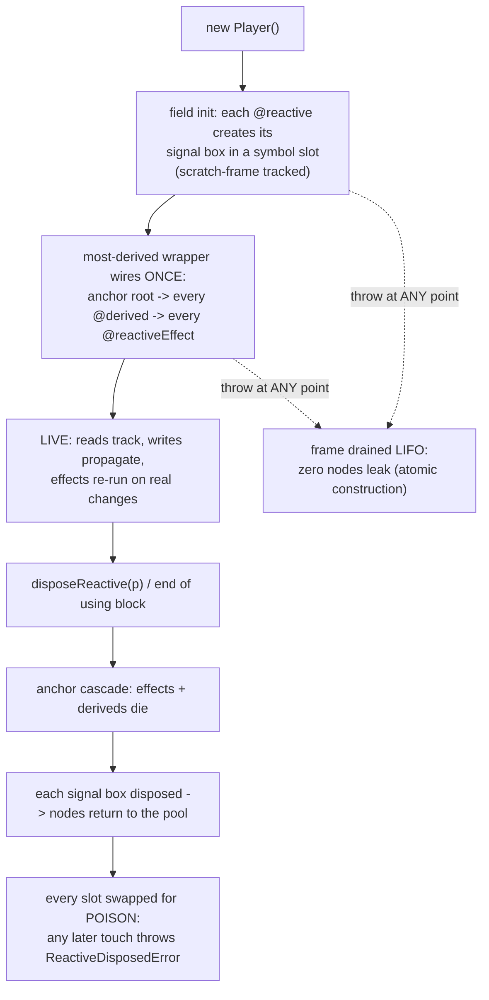

# @zakkster/lite-signal-decorators

[](https://www.npmjs.com/package/@zakkster/lite-signal-decorators)
[](https://github.com/sponsors/PeshoVurtoleta)

[](https://bundlephobia.com/result?p=@zakkster/lite-signal-decorators)
[](https://www.npmjs.com/package/@zakkster/lite-signal-decorators)
[](https://www.npmjs.com/package/@zakkster/lite-signal-decorators)
[](https://www.npmjs.com/package/@zakkster/lite-signal)

[](https://opensource.org/licenses/MIT)

> Stage-3 decorators that turn a plain class into a reactive view-model with a
> measured per-property cost, one deterministic teardown, and poison-on-dispose
> safety -- built on @zakkster/lite-signal.

**`@reactive accessor` fields, `@derived` getters, `@reactiveEffect` methods, `@batched` actions, one `@reactiveHost` wiring site -- and `disposeReactive()` tears the whole instance down in one call, every time, with nothing left dangling. A decorated read costs ~1.0x a hand-written instance-field signal read. An instance costs exactly P + D + E + 1 pool nodes and gives all of them back on dispose. A buildless twin, `defineReactive()`, delivers the identical feature set with zero transpiler.**

```js
import { reactive, derived, reactiveHost, disposeReactive } from "@zakkster/lite-signal-decorators";

@reactiveHost
class Vector {
  @reactive accessor x = 3;
  @reactive accessor y = 4;
  @derived get len() { return Math.hypot(this.x, this.y); }
}

const v = new Vector();
v.len;              // 5
v.x = 6;
v.len;              // 7.211...
disposeReactive(v); // cascade teardown; later touches throw ReactiveDisposedError
```

No base class to extend. No `makeObservable(this, {...})` mirror object to keep in sync. No "did I remember to dispose the reaction?" -- the instance IS the lifetime, and when it ends, every box, computed, and effect it owns ends with it, provably (a 4096-cycle leak gate and a wall-clock churn soak run on every change).

---

## Contents

- [The reactive class layer the ecosystem was missing](#the-reactive-class-layer-the-ecosystem-was-missing)
- [What you get](#what-you-get)
- [How it works](#how-it-works)
- [The half-alive view-model trap](#the-half-alive-view-model-trap)
- [API reference](#api-reference)
- [Composability](#composability)
- [The numbers](#the-numbers)
- [Design decisions worth knowing](#design-decisions-worth-knowing)
- [Testing (for clients & QA)](#testing-for-clients--qa)
- [Compatibility](#compatibility)
- [What this is not](#what-this-is-not)
- [Ecosystem](#ecosystem)
- [FAQ](#faq) - [License](#license)

---

## The reactive class layer the ecosystem was missing

Fine-grained signal engines are function-shaped: `signal()`, `computed()`, `effect()`. Real applications are often class-shaped: an entity in a fleet, a HUD panel, a document model -- a thing with identity, N reactive properties, derived state, reactions, and a *death*. The gap between the two is where reactive class layers historically go wrong: MobX-style decorators bring GC pressure and administration objects; hand-rolling `this.x = signal(0)` per class brings copy-pasted dispose lists that drift out of sync with the fields.

`lite-signal-decorators` is that layer done with lite-signal's discipline: **zero allocation on the hot path, a measured cost for everything else, and fail-closed on every unverified state.** Every property you declare is accounted for -- created at a known point, owned by a known root, destroyed by one call, poisoned afterward so a stale reference throws by name instead of misbehaving silently.

### Install

```bash
npm i @zakkster/lite-signal-decorators @zakkster/lite-signal
```

`@zakkster/lite-signal` (`>=1.5.0 <2.0.0`) is a **peer dependency**, and that is a correctness requirement, not a formality: your decorated instances, your raw signals, and the engine's node pool must live in ONE reactive graph. A second nested copy of the engine would silently split that graph. Install both at the top level.

ESM-only. Ships TypeScript definitions. Node >= 18. The `@` syntax needs a Stage-3 decorator toolchain (TypeScript 5 or Babel `2023-11` -- see [Compatibility](#compatibility)); [`defineReactive`](#definereactiveclass-spec---class) needs nothing.

### Quick start

```js
import {
  reactive, derived, reactiveEffect, batched, reactiveHost, disposeReactive,
} from "@zakkster/lite-signal-decorators";

@reactiveHost
class Player {
  @reactive accessor hp = 100;
  @reactive accessor shield = 50;

  @derived get effectiveHp() { return this.hp + this.shield * 0.5; }
  @derived get status() { return this.effectiveHp > 60 ? "healthy" : "critical"; }

  // Auto-runs as an effect once the instance is wired; re-runs only when
  // `status` actually CHANGES -- the derived's equality cutoff absorbs the rest.
  @reactiveEffect onStatus() { hud.textContent = this.status; }

  // Both writes coalesce into ONE propagation flush.
  @batched hit(dmg) {
    const absorbed = Math.min(this.shield, dmg);
    this.shield -= absorbed;
    this.hp -= dmg - absorbed;
  }
}

const p = new Player();  // exactly 2 + 2 + 1 + 1 = 6 pool nodes (P + D + E + 1)
p.hit(80);               // shield 0, hp 70 -> status still "healthy": effect does NOT re-run
p.hit(20);               // hp 50 -> "critical": effect runs once
disposeReactive(p);      // effect stopped, deriveds + boxes disposed, slots poisoned
```

No transpiler? The **buildless twin** takes a plain class and a spec, and routes through the *same* wiring core (shared by function identity, not merely behaviorally alike) -- this exact form runs in stock Node:

```js
import { batch } from "@zakkster/lite-signal";
import { defineReactive, disposeReactive } from "@zakkster/lite-signal-decorators";

class Player {
  hit(dmg) {
    batch(() => {
      const absorbed = Math.min(this.shield, dmg);
      this.shield -= absorbed;
      this.hp -= dmg - absorbed;
    });
  }
}

const ReactivePlayer = defineReactive(Player, {
  signals: { hp: 100, shield: 50 },
  deriveds: {
    effectiveHp: (self) => self.hp + self.shield * 0.5,
    status: (self) => (self.effectiveHp > 60 ? "healthy" : "critical"),
  },
  effects: { onStatus: (self) => { hud.textContent = self.status; } },
});
```

---

## What you get

- **`@reactive accessor x = v`** -- a per-instance signal box in a unique symbol slot. The read body is one slot load + one monomorphic box call: zero branches, zero allocation.
- **`@derived get y()`** -- a lazy computed owned by the instance's anchor, with optional custom `equals` for change-cutoff.
- **`@reactiveEffect m()`** -- a method that auto-runs as an effect after wiring. Manual calls are leak-guarded (a call inside a foreign tracking scope is untracked, so it records zero stray dependencies) and identity-guarded (a foreign receiver throws by name instead of running against garbage).
- **`@batched m()`** -- the method body inside one engine batch: N writes, one flush. Action-grade by design, with a measured per-call cost -- not a per-frame path.
- **`@reactiveHost`** -- the single wiring site. Its most-derived constructor builds the anchor, every derived, and every effect exactly once, after all fields of all classes in the chain initialize. `@reactiveHost({ registry })` binds the whole chain to an isolated lite-signal registry.
- **`defineReactive(Class, spec)`** -- the complete feature set with zero decorator syntax.
- **One deterministic teardown** -- `disposeReactive(vm)` (or a `using` block): anchor cascade, box disposal, poison swap, idempotent, allocation-free on the success path.
- **Fail-closed everything** -- statics, private `#` members, unknown options, duplicate keys, orphaned members, invalid registries, half-valid specs: all named throws at decoration time, with a nearest-key did-you-mean where a typo is likely.
- **Interop that stays raw** -- `boxOf(vm, key)` hands you the live engine box; `rootOf(vm)` hands the anchor descriptor to `forEachOwned` / lite-devtools. Decorated and hand-written signals share one graph.

---

## How it works



Decoration happens once per class: each decorator validates its placement (fail closed) and registers the member in the class's wiring plan. Construction happens per instance: field initializers create the signal boxes, then the most-derived `@reactiveHost` wrapper -- and only it, so inheritance chains wire exactly once -- creates one anchor root and, under that owner, every derived and every effect in declaration order. Disposal reverses it: the anchor cascade takes the deriveds and effects, the boxes are disposed explicitly, and every slot is replaced by a poison handle.

<details>
<summary><strong>Deep-dive: the core surface, mechanically</strong></summary>

**The hot path is canon.** The accessor bodies are frozen as:

```js
function makeGet(slot) { return function () { return this[slot].get(); }; }
function makeSet(slot) { return function (v) { this[slot].set(v); }; }
```

One symbol-slot load, one monomorphic call, no branch, no closure state beyond the slot. The zero-GC torture lane diffs behavior against this shape on every change; the storage layout (a unique per-property `Symbol` on the instance) was chosen over a private-backing or dictionary layout on measured fleet behavior and poison-mechanism consistency ([decisions/0003](decisions/0003-storage.md)).

**Ownership is asymmetric on purpose.** The anchor (one `createRoot` per instance) owns the deriveds and effects, so one cascade kills them all in the engine. Signal boxes are created *bare* -- not adopted by the anchor -- and disposed explicitly by `disposeReactive`. That split is what makes the accessor read body branch-free: a box that can never be half-owned needs no liveness check on the hot path; the poison swap provides the post-dispose throw instead.

**Poison is a slot swap, not a flag.** After dispose, `instance[SLOT]` holds a poison handle whose `get`/`set` throw `ReactiveDisposedError` naming `Class.key`. The read body stays the unbranched canon -- disposal changes what the slot *holds*, never what the accessor *does*.

**Effects wire last and guard their manual door.** The auto-effect wraps the original method and starts at wiring, after every field and every derived of the whole chain exists. The public method you call by hand is a guard: inside a foreign tracking scope it runs the body `untrack`-ed (zero stray edges); on a receiver that was never wired to this member's class family it throws by name (byKey identity, so a subclass instance calling a base-declared method passes).

**Construction is atomic at every capacity point.** Signal boxes are born during `super()` field initialization -- *before* any try/catch of the wiring phase could exist. A module-level scratch frame records each box as it is created; the frame is owned by the most-derived wrapper only, so a `CapacityError` (or any throw) at ANY point -- K-th box, the anchor, m-th derived, m-th effect, on either construction path -- drains the frame LIFO through the bound registry and rethrows. `new` either returns a fully-wired instance or leaves the pool exactly as it found it. Nested constructions (a field initializer building another reactive VM) unwind correctly because the frame marker is a stack index. ([decisions/0002](decisions/0002-ownership-and-lifecycle.md), D-2h -- including the two hardenings review and torture forced.)

</details>

---

## The half-alive view-model trap

The failure mode this package is built against is not "reactivity doesn't work" -- it is the **half-alive instance**: an object that looks disposed from one side and alive from the other. It has three classic doors, and each one is closed and torture-pinned:

**1. The dangling-teardown door.** In ad-hoc class reactivity you collect dispose functions by hand; miss one and a dead panel keeps recomputing forever. Here the instance's whole graph hangs off one anchor plus a box list the *package* maintains, `disposeReactive` is idempotent, and -- the part hand-rolled layers never do -- every slot is **poisoned** afterward. A stale captured reference doesn't quietly read a frozen value or resurrect an effect; it throws `ReactiveDisposedError` with the class and key in hand. A scripted resurrection storm (every post-dispose call sequence: captured-box writes, `using` re-entry, double dispose, cross-instance writes) must produce zero effect executions and zero derived recomputes, on every release.

**2. The cross-registry door.** lite-signal's default `dispose` is documented as a *silent no-op* across registries -- the engine's one fail-open corner. A class layer that creates boxes on a custom registry but disposes through top-level helpers would leak every node while returning normally. So the package refuses the door entirely: `@reactiveHost({ registry })` binds the WHOLE host chain, every engine call routes through the bound registry, and a subclass trying to bind a *different* registry is a named throw. One chain, one graph, no silent mismatch.

**3. The mid-construction door.** A capacity overflow while the K-th of P boxes is being created would classically leak boxes 1..K-1 -- `new` throws, nobody owns the orphans, conservation is off by K-1 forever. The scratch-frame protocol ([deep-dive above](#how-it-works)) makes construction transactional: any throw at any creation point tears down exactly what was built, LIFO, and rethrows. The torture suite primes a registry to N-epsilon and drives the overflow into *every* failure point on *both* construction paths, asserting node-exact conservation and that the identical construction succeeds once headroom returns.

---

## API reference

### Member decorators

All four take a bare form and a factory form (`@reactive` and `@reactive({...})` both work).

| Decorator | Placement | Options | Behavior |
|---|---|---|---|
| `@reactive` | `accessor x = v` | `equals(a, b)` | Per-instance signal box in a symbol slot. Read tracks; write propagates; custom `equals` suppresses no-op writes. |
| `@derived` | `get y()` | `equals(a, b)` | Lazy computed owned by the anchor. Recomputes on dependency change; `equals` cuts propagation when the result is unchanged. |
| `@reactiveEffect` | `m()` | `scheduler(run)` | Auto-runs as an effect at wiring, re-runs on tracked changes. `scheduler` defers re-runs (frame coalescing etc.). Manual calls: leak-guarded + identity-guarded. |
| `@batched` | `m()` | -- | Runs the body inside one engine batch: all writes flush once, at close. Nesting flushes at the outermost close. Action-grade -- see [the numbers](#the-numbers). |

### Class decorator

| Form | Behavior |
|---|---|
| `@reactiveHost` | The single wiring site; wraps the class so the anchor + deriveds + effects are built exactly once, after all fields of the whole chain initialize. A subclass of a host may itself be a host (inheriting or repeating the chain's registry) -- however many hosts a chain carries, only the most-derived one wires. A decorated member in a hierarchy that never gets a host is the orphan throw. |
| `@reactiveHost({ registry })` | Same, with every engine call routed through a `Registry` from lite-signal's `createRegistry()`. The value is duck-checked (all 11 engine methods); one registry per host chain -- a subclass may repeat the same object or omit it, never substitute another. |

### `defineReactive(Class, spec) -> Class'`

The buildless twin. Installs the members on `Class.prototype`, wraps the class through the same host step, returns the wrapped class.

| Spec key | Shape | Notes |
|---|---|---|
| `signals` | `["a", "b"]` or `{ key: value \| { initial \| init \| equals } }` | A plain non-function value is the initial. `initial` is taken verbatim; `init(self)` computes per instance; a bare function is a named throw (ambiguous -- wrap it). |
| `deriveds` | `{ key: (self) => value \| { get, equals } }` | |
| `effects` | `{ key: (self) => void \| { run, scheduler } }` | Map only. |
| `host` | `{ registry }` or omitted | Same validation as `@reactiveHost`. |

Symbol keys work (`Reflect.ownKeys`). A spec key colliding with an own property of `Class.prototype` is a named throw. The class's own constructor runs *before* wiring, so it must not touch spec-declared members (a prewired handle turns any such touch into a named error) -- put initials in the spec. There is no `batched` section: buildless callers use `batch`/`registry.batch` directly. Post-construction behavior is in full parity with the decorator path -- a 300-seed fuzzer holds both forms in lockstep to prove it.

### Lifecycle & interop

| Export | Signature | Behavior |
|---|---|---|
| `disposeReactive` | `(vm) => boolean` | Cascade + poison teardown. `true` on the first call, `false` after (idempotent). Also wired to `Symbol.dispose`, so `using vm = new Player()` disposes at block exit. Refuses a frozen instance up front (named throw, nothing half-done). |
| `boxOf` | `(vm, key) => SignalBox \| ComputedBox` | The live engine box behind a `@reactive`/`@derived` member -- `.peek()`, `.subscribe()`, raw interop. Unknown key: named throw with a did-you-mean. After dispose: `ReactiveDisposedError`. |
| `rootOf` | `(vm) => NodeDescriptor` | The instance's anchor descriptor -- feeds `forEachOwned` and lite-devtools. Throws `ReactiveDisposedError` after dispose. |

### Introspection & audit (0.4.0)

| Export | Signature | Behavior |
|---|---|---|
| `costOf` | `(Factory) => { nodes, links, signals, deriveds, effects }` | The measured, settled per-instance cost, probed on the class's bound registry (frozen result, cached per class). Double-probed: an inconclusive or polluted probe THROWS -- never a guess. `nodes` is exactly P + D + E + 1; `links` is the first-full-read link count. |
| `capacityFor` | `(inventory, { headroom }?) => RegistryConfig` | Sizes a `createRegistry` config from `[Factory, count]` pairs: nodes exact, links x `headroom` (floored at the engine minimum of 1), `prealloc: "eager"`, `onCapacityExceeded: "throw"`. Fail-closed inventory and options validation. Link policy + caveats: [decisions/0007](decisions/0007-capacity-policy.md). |
| `enableLabels` / `labelOf` | `(on)` / `(idOrHandle, registry?) => string \| undefined` | Opt-in devtools identity (default OFF): while on, wiring registers per-registry `nodeId -> "Class.prop"` / `"Class#method"` / `"Class@anchor"`; dispose unregisters. `labelOf` misses return `undefined`, never throw. |
| `auditReactive` | `(on)` | Opt-in leak auditor (default OFF): a lazily-created `FinalizationRegistry` reports any instance collected WITHOUT `disposeReactive`, naming class and shape. Holds no instance references itself; zero cost and zero registrations while off. |

With labels and audit off, the zero-GC budgets are byte-identical to 0.3.0 -- the hot accessor canon is untouched by all four (review-diffed against the published 0.3.0 tarball).

### Errors & constants

| Export | Value |
|---|---|
| `ReactiveDisposedError` | `extends Error`; `name: "ReactiveDisposedError"`; fields `className`, `key`. Thrown on ANY touch of a disposed instance's surface. |
| `VERSION` | `"0.4.0"` |

### The rejection matrix

Everything below is a **named throw at decoration/definition time** -- never a silent downgrade: legacy (experimental) decorator emit; wrong decorator kind; static members; private `#` members; unknown option keys (nearest-key did-you-mean); non-function `equals`/`scheduler`; double `@reactiveHost`; unknown host options; orphaned members (a decorated member whose class never gets a host); duplicate keys (subclass redeclaration or two stacked package decorators on one member); an invalid or partial `registry`; a heterogeneous registry chain; and every malformed `defineReactive` spec shape.

---

## Composability

Decorated instances, raw engine code, an isolated registry, and devtools introspection -- one graph, end to end. This block is buildless, so it runs verbatim in stock Node:

```js
import { createRegistry } from "@zakkster/lite-signal";
import { defineReactive, disposeReactive, boxOf, rootOf } from "@zakkster/lite-signal-decorators";

// An isolated world: its own node pool, its own graph.
const world = createRegistry({ maxNodes: 256, onCapacityExceeded: "throw" });

class Ship {}
const ReactiveShip = defineReactive(Ship, {
  signals: { hull: 100 },
  deriveds: { dead: (self) => self.hull <= 0 },
  host: { registry: world },
});

const fleet = Array.from({ length: 3 }, () => new ReactiveShip());

// A RAW engine effect in the same graph, reading a decorated member:
const stop = world.effect(() => {
  console.log("dead ships:", fleet.filter((s) => s.dead).length);
});                                    // logs: dead ships: 0

fleet[1].hull = 0;                     // decorated write -> raw effect: dead ships: 1

// boxOf hands the live box -- raw writes flow back the other way:
boxOf(fleet[0], "hull").set(-5);       // raw write -> decorated derived: dead ships: 2

// rootOf feeds the registry's ownership walk (and lite-devtools):
world.forEachOwned(rootOf(fleet[2]), (d) => console.log("owned node:", d.kind));

// Deterministic shutdown, conservation-exact:
world.dispose(stop);
for (const s of fleet) disposeReactive(s);
console.log(world.stats().activeNodes); // 0 -- every node returned to the pool
```

The default registry never notices any of it: bound-registry churn leaves outside `stats()` frozen (torture-pinned). And because `boxOf` returns the *engine's* box, everything lite-signal composes with -- subscriptions, `peek`, batch, untrack, lite-raf frame effects -- composes with decorated members too.

---

## The numbers

Measured, not asserted: every figure below comes from a committed probe you can re-run, and the repository's gates fail if the zero-allocation claims drift. Rig for the figures quoted: Node v26.3.1, arm64 (Apple M4 Pro), lite-signal 1.5.0, K=10 cold child processes, inner median-of-5, anti-DCE sink. The ratios are what is stable across machines, not the absolute nanoseconds.

### The honest read cost (`spikes/storage-bench.mjs`)

The fair baseline for a decorated property is a hand-written instance field (`this.bx.get()`) -- not a module-level signal, which no one writes in a class:

| Read | vs module-const box | vs instance-field box | 10k-instance fleet (ns/op) |
|---|---:|---:|---:|
| Module-const `signalBox` (floor) | 1.000x | 0.464x | 5.22 |
| Hand-written instance field | 2.13x | 1.000x | 6.57 |
| **Decorated accessor (this package)** | **2.12x** | **~1.0x** (median 1.01x, worst cold-vs-cold 1.08x) | **7.81** |
| String-keyed dict layout (rejected) | 2.19x | 1.03x | 9.93 |

A decorated reactive property costs **~1.0x a hand-written instance-field signal read**; both are ~2x a module-level signal because that is the cost of per-instance storage, paid either way -- an engine indirection, not a decorator tax. Writes are ~2.5-3x a module-const read across all instance layouts (box `.set` propagation dominates; inherent to any reactive write). The rejected dictionary layout is the one that *degrades at fleet scale* (cross-instance IC megamorphism) -- the hazard only a class-shaped benchmark exposes, and the reason this package doesn't use one.

### `@batched` per call (`spikes/batched-cost.mjs`)

| Path | ns/op |
|---|---:|
| Plain unbatched method (2 writes) | 11.67 |
| Raw `batch(fn)` | 15.25 |
| `@batched` method | 22.12 |

The ~7 ns over raw batch is the guarded thunk + rest-array the decorator allocates per call -- **by design**. `@batched` is action-grade (one call per user intent), deliberately excluded from the zero-GC gates; per-frame hot lanes stay on plain accessor writes.

### Per instance

`P + D + E + 1` pool nodes -- one per signal, per derived, per effect, plus the anchor. All of them return to the pool on dispose: conservation is node-exact (`activeNodes` to baseline, zero pool growths, allocations minus disposals reconciled) over 4096-cycle churn and a wall-clock soak.

<details>
<summary><strong>Zero-GC design notes: the allocation table + the gates</strong></summary>

| Operation | Allocates | Notes |
|---|---|---|
| `vm.x` read | none | `this[SLOT].get()` -- allocation-free within measurement resolution (<= the 0.589 B/op noise-floor control; `gc.major === 0` in every lane) |
| `vm.x = v` write | none | `this[SLOT].set(v)`; propagation runs on engine pool nodes, not fresh heap |
| `@derived get` read | none | lazy computed read |
| Effect re-run | none retained | gated: zero major GC across the read/write torture lanes |
| `@batched m()` call | 1 thunk + 1 rest array | the documented, measured exception (+7 ns vs raw batch); action-grade only |
| `new Host()` | P + D + E + 1 pool nodes | plus the instance itself; nodes recycle on dispose (F-0 conservation) |
| `disposeReactive(vm)` | none | allocation-free success path; poison handles are prebuilt per member at decoration time |
| `boxOf` / `rootOf` / any throw | cold path | introspection and failure paths may allocate; never on the hot path |

The gates that hold it (run on every change, all green at 0.2.0):

- `npm test` / `npm run test:gc` -- **171/171** on both lanes.
- Suite gate (lite-leak + lite-gc-profiler): `leak=size 0/0 findings=0 warnings=0 | gc major=0 minor=0 maxMs=0.00 | ok`.
- Torture: **12/12 scenarios** (zero-GC read/write lanes at `maxMajor 0, maxPauseMs 4`; 4096-cycle leak gate at 0 live / 0 findings / 0 warnings; capacity atomicity at every overflow point; a 300-seed x 20k-op oracle with zero divergences) -- plus **12/12 sabotage controls** proving each gate can actually fail.
- `churn-soak`: sustained construct/use/dispose for a wall-clock budget; pools at floor and retained heap flat at every sample.

The cross-framework matrix lives in `bench/` (private, never shipped): six engines -- both our tiers, the hand-written `lite-raw-boxes` baseline, MobX 7, signal-utils/signal-polyfill, and a hand-rolled alien-signals class -- across seven class-shaped scenarios, checksum-verified for identical work, stamped into `bench/results.txt`. The formal verdicts are in [`decisions/0006-kill-criteria.md`](decisions/0006-kill-criteria.md): the decorated path measured **0.94x** the hand-written baseline on vm-write and **1.10x** on a 10k-instance fleet read (the 2.0x kill line cleared with margin), and **0 major + 0 minor GC over 4096 construct/use/dispose cycles** with pools at floor -- while emitting ~12.6x less transient garbage per churn run than the hand-rolled class it replaces.

</details>

---

## Design decisions worth knowing

Full rationale lives in [`decisions/`](decisions/) -- each is a numbered, dated record with its measured evidence. The ones that shape daily use:

- **One registry per host chain.** `@reactiveHost({ registry })` binds everything; a descendant passing a *different* registry is a named throw. This is what closes the engine's silent cross-registry dispose no-op. `setDefaultRegistry` mid-life is out of contract (the facade captures import-time bindings).
- **Derived getters must be pure -- effects may self-dispose.** `disposeReactive(this)` from inside your own `@derived` computation throws by name (it would silently drop the derivation's value). From inside an *owned* `@reactiveEffect` it is allowed with pinned semantics: the current run completes, later decorated touches in that body throw `ReactiveDisposedError`, no re-runs follow, conservation stays exact.
- **Two documented limits of the derived guard** (pinned in torture so drift is loud): an indirect self-dispose routed through an intermediate *raw* computed is not catchable with the 1.5.0 engine surface, and an explicit `untrack()` wrap bypasses the guard -- the escape hatch working as intended.
- **Manual effect/batched calls are guarded twice.** Inside a foreign tracking scope the body runs untracked (zero stray dependency edges); on a foreign/null/primitive/cross-class receiver it throws by name. Subclass instances calling base-declared methods pass (byKey identity).
- **Frozen instances refuse disposal up front.** `Object.freeze(vm)` makes the poison swap impossible, so `disposeReactive` throws by name *before* touching anything -- no half-dispose. `seal`/`preventExtensions` are fine.
- **Symbol-slot storage.** Chosen over the emitter's private backing (emitter-dependent codegen) and a dict (fleet megamorphism, measured) -- and it is the same mechanism poison uses, so storage, dispose, and poison are one design.
- **Statics and `#` privates are rejected, not half-supported.** A module-level signal belongs to raw lite-signal; a private member can't be reached by the wiring protocol -- both are named decoration-time throws.

---

## Testing (for clients & QA)

```bash
npm test            # node --test, 171 tests
npm run test:gc     # the same 171 with --expose-gc (enables the allocation assertions)
```

**171 tests** across eleven files, all green at 0.2.0. The decorator protocol is tested three times over: against a mock Stage-3 emitter *and* against committed real TypeScript 5 and Babel `2023-11` emits, so both toolchains' codegen is pinned, not assumed.

| File | Tests | Covers |
|---|---:|---|
| `01-protocol-mock` | 30 | Decorator protocol on the mock Stage-3 emitter: wiring, values, options, rejection matrix |
| `02-fixtures-ts` | 19 | The same laws on real TypeScript 5 emit (committed fixtures) |
| `03-fixtures-babel` | 19 | The same laws on real Babel `2023-11` emit |
| `04-fixture-freshness` | 1 | Fixture hashes match the sources (stale-emit guard) |
| `05-wiring` | 5 | Anchor creation, wiring order, leaf-wires-once |
| `06-dispose` | 6 | Cascade, idempotency, poison, `using` |
| `07-qa-boundary` | 13 | S1 adversarial boundary pins |
| `08-effects` | 20 | `@reactiveEffect`/`@batched`: auto-run timing, untracking, scheduler, self-dispose, inheritance, registries |
| `09-buildless` | 16 | `defineReactive` parity + the spec rejection matrix |
| `10-qa-s2a-boundary` | 34 | Adversarial pins: identity guard, frozen dispose, registry heterogeneity, stacking |
| `11-qa-s2b-boundary` | 8 | Construction-throw boundaries: init-phase drain, chain-base throws, overflow storms |

### The torture suite (dev-side, never shipped)

Process-isolated stress scenarios built on `@zakkster/lite-leak` + `@zakkster/lite-gc-profiler`:

```bash
npm run torture             # all 12 scenarios
npm run torture:semantic    # the correctness lane (CI)
npm run torture:soak        # the wall-clock churn soak
npm run torture:controls    # sabotage self-test: every scenario must FAIL when broken
```

Twelve scenarios: emit-matrix, ordering, lifecycle, pool-conservation, zero-GC lanes, capacity atomicity (every overflow point x both construction paths), the full disposed-poison surface + resurrection storms, a 4096-cycle lite-leak gate, a **300-seed x 20k-op oracle fuzzer** (decorated vs hand-wired raw twin in lockstep: every derived value, every effect fire count, every graph opcode tally), raw/decorated interop + cross-registry + `registry.destroy()` contracts, batch/untrack semantics, and the churn soak. Every scenario carries a `TORTURE_BREAK` sabotage control that must exit non-zero -- a gate that cannot fail is not a gate. Seeded lanes replay exactly via `TORTURE_SEED`.

---

## Compatibility

| Path | Requirement |
|---|---|
| `@` decorator syntax | A Stage-3 (2023-11) decorator toolchain: **TypeScript >= 5.0** (standard decorators -- leave `experimentalDecorators` unset/false) or **Babel** with `["@babel/plugin-proposal-decorators", { "version": "2023-11" }]`. Both emits are first-class: the suite pins each with committed fixtures. |
| `defineReactive` | Nothing. Any ESM runtime. |
| Runtime | Node >= 18 (ESM-only, `sideEffects: false`); browsers via any ESM bundler or native modules. No DOM dependency anywhere in the package. |
| Peer | `@zakkster/lite-signal` `>=1.5.0 <2.0.0`, installed at the top level (one engine instance, one graph). |

Native (untranspiled) `@` decorators in engines: not shipped anywhere yet -- until they are, the decorator syntax is toolchain-only and `defineReactive` is the no-build door.

---

## What this is not

- **Not a home for module-level or global signals.** That is raw `lite-signal` territory; `static` members are rejected by design.
- **Not a per-frame action system.** `@batched` costs a measured thunk per call -- fine for "one call per user intent", wrong inside a render loop. Per-frame hot lanes stay on plain accessor writes (and frame *scheduling* belongs to `lite-raf`).
- **Not a framework, renderer, or component model.** It ends at the reactive view-model; DOM binding is `lite-signal-dom`'s job.
- **Not a MobX API shim.** No `makeObservable`, no administration objects, no proxy magic -- and no GC-based cleanup: disposal is explicit, deterministic, and verified, because "the collector will get it eventually" is not a lifecycle.
- **Not usable as `@` syntax without a toolchain** -- that is exactly what `defineReactive` exists for.

---

## Ecosystem

| Package | Relation |
|---|---|
| [`@zakkster/lite-signal`](https://www.npmjs.com/package/@zakkster/lite-signal) | The engine underneath -- pooled fine-grained signals. The one peer dependency. |
| `@zakkster/lite-signal-dom` | DOM bindings for the same engine -- where a view-model meets actual elements. |
| `@zakkster/lite-raf` | Frame-rate scheduling for the same graph; the frame-coalescing pattern the `scheduler` option on `@reactiveEffect` exists to plug into. |
| `@zakkster/lite-devtools` | Graph inspection; `rootOf(vm)` + `forEachOwned` is the hook it walks. |
| `@zakkster/lite-leak` + `@zakkster/lite-gc-profiler` | The dev-side harness that proves every retention and allocation claim in this README. Never shipped to consumers. |

---

## FAQ

**Why the `accessor` keyword?**
It is the Stage-3 mechanism that gives a decorator both an `init` hook (create the box during field initialization -- eagerly, so the getter carries no `if (!box)` lazy branch) and replaceable get/set bodies, without per-instance `defineProperty` calls or a base class. `@reactive` on a plain field is a named throw pointing you to `accessor`.

**How is this different from MobX's `@observable`?**
Philosophy: MobX trades allocation and administration overhead for maximal transparency; this package trades a little syntax (`accessor`, explicit dispose) for zero hot-path allocation, a node-exact instance cost, and a teardown you can prove. There is no proxy, no administration object per instance, and nothing is left for the GC to find "eventually" -- which is precisely what makes 10k-instance fleets and long sessions flat.

**Why explicit dispose? Can't the GC handle it?**
Reactive nodes live in lite-signal's pre-allocated pool and effects are *reachable from the graph* -- a forgotten view-model is not garbage, it is a live subscriber that keeps firing. `FinalizationRegistry` is non-deterministic and unobservable in torture terms. Explicit `disposeReactive` (or `using`) is one call, idempotent, allocation-free -- and the poison swap turns any lifecycle bug into a named, debuggable throw instead of a silent leak.

**What happens if the pool fills up mid-`new`?**
The engine's `CapacityError` propagates from the constructor and construction is **atomic**: everything already created for that instance is rolled back, node-exact -- no leak, and the same construction succeeds once headroom exists. If you need more headroom, size the registry:

```js
import { createRegistry } from "@zakkster/lite-signal";
const world = createRegistry({ maxNodes: 8192, onCapacityExceeded: "grow" });

@reactiveHost({ registry: world })
class Entity { /* ... */ }
```

**Can decorated instances and raw lite-signal code share a graph?**
Yes -- that is a torture-pinned contract, both directions: raw effects reading decorated members, decorated deriveds reading raw boxes, subscriptions through `boxOf` handles. Decorated members ARE engine boxes; there is no wrapper layer to cross.

**Why is passing a different registry to a subclass an error?**
Because an instance whose base-class boxes live in one pool and whose subclass boxes live in another cannot be disposed correctly by anyone -- the engine's cross-registry dispose is a silent no-op. One chain, one registry is the only shape with a provable teardown, so any other shape throws at decoration time.

**Is `@batched` free?**
No, and the README says so with numbers: 22.12 ns/op vs 15.25 raw vs 11.67 unbatched on the reference rig -- a thunk + rest-array per call. Use it for actions; keep per-frame writes on plain accessors.

**Where are `costOf`, labels, the audit hook, private members?**
The first three landed in 0.4.0 -- `costOf`/`capacityFor` (measured capacity accounting), `enableLabels`/`labelOf` (devtools identity), and `auditReactive` (leak audit), all cold-path or opt-in with the hot canon untouched. Private-member support remains out. The `llms.txt` scope note tracks exactly what is and isn't included.

---

## License

MIT (c) Zahary Shinikchiev <shinikchiev@yahoo.com>
